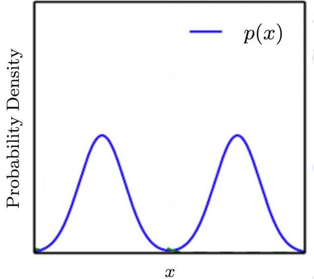
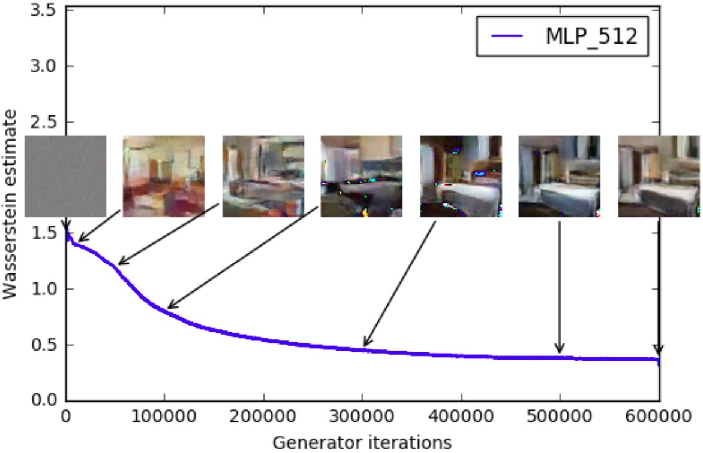
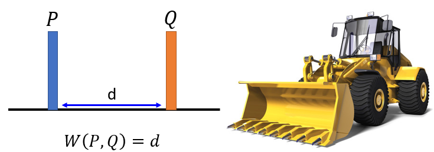
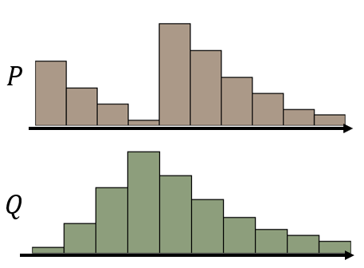
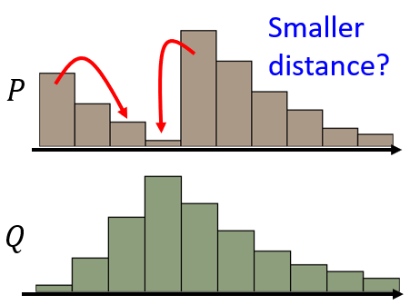
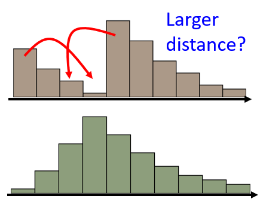
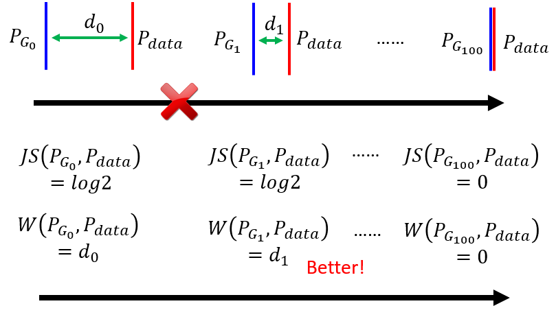
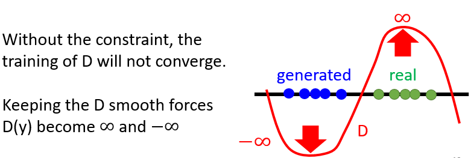
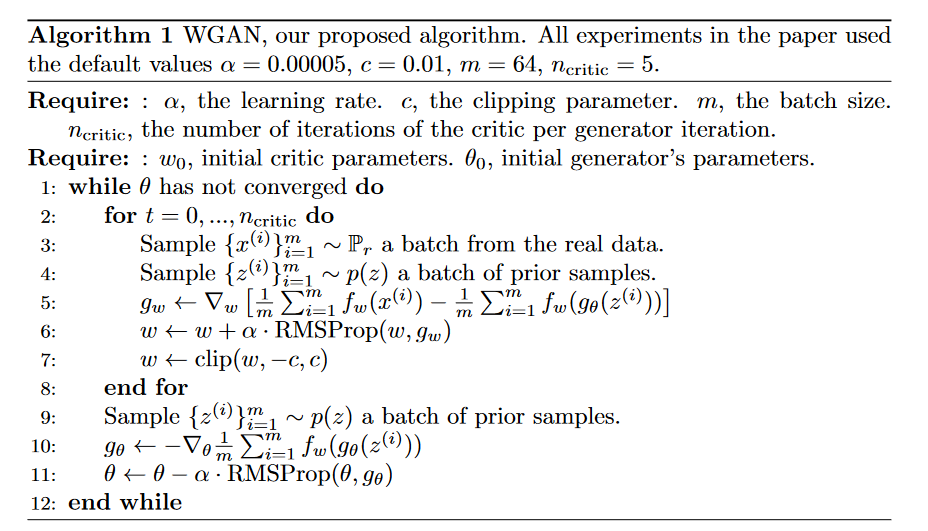

## 信息论中的熵

### 信息量

任何一个事件都会承载一定的信息，包括已经发生的事情和未发生的事情，只是它们承载的信息量有所不同。例如对于一件已经发生的事情，它已经是既定的事实，所以它的信息量为零。因此，信息是用来表征事物的不确定性。

例如:假设有一个100面的骰子，99个面都是1，只有1个面是0，如果投掷得到的结果是0，则它可以带来的信息量一定是巨大的，因为只有1个面是0，通过这个结果可以唯一确定掷出来是哪一个面。

因此，我们希望通过一个公式$f(p)$来描述信息量，这个公式是关于事件发生概率$p$的函数，它应该满足：

* $f(p)\ge0$
* 是一个减函数
* $f(1)=0$
* 对于两件相互独立的事情，它们同时发生了，获得的信息量是它们分别的信息量之和

综上，发现对数函数满足上述性质，因此定义信息量$f(p)$
$$
f(p)=-\log_2p
$$
这里其实只需要一个对数函数即可满足上述要求，主要是遵循信息论的传统，选择以2为底数的对数函数。

### 信息熵

*信息量表征的一个可能事件如果真的发生了能带来的信息量，而信息熵表征的是知道一个事件发生的结果后，平均会给你带来多大的信息量，因此它是所有可能发生事件带来的信息量的期望，定义*
$$
H(X)=-\sum_{i=0}^np(x_i)\log_2p(x_i)
$$

## Kullback-Leibler divergence（简称 KL 散度）

相对熵（relative entropy）又称KL散度，如果我们对于同一个随机变量$x$有两个单独的概率分布$p(x)$和$q(x)$，可以使用KL散度来衡量这两个分布之间的差异，记作$D(p||q)$。在机器学习中，$p$往往用来表示样本的真实分布，$q$用来表示模型所预测的分布，且通常为离散随机变量，KL散度的定义为
$$
D(p||q)=\sum_{i=1}^Np(x_i)\log \frac{p(x_i)}{q(x_i)}
$$
对于KL散度的简单理解：当部分真实样本的概率$p(x_i)$很小，而预测的分布$q(x_i)$很大时，对应某些样本$i$计算出来的对数函数值为负，但是系数很小，而反过来当部分真实样本的概率$p(x_i)$很大，而预测的分布$q(x_i)$很小时，对应某些样本$i$计算出来对数值为正，此时系数很大，导致KL的散度变得很大，且永远满足$D(p||q)\ge0$，因此真实分布与预测分布的差距越大，KL散度越大。

*不难看出，当真实样本和预测样本的分布没有重合时，例如$q(x_i)=0$时，如果$p(x_i)\ne0$，导致KL散度会趋向无穷大，这时两个分布的差异便无法表征*

**因此，这里可以做如下理解，如果想让两个分布接近，即KL散度尽可能小，是希望在真实样本分布$p(x_i)$很大时，预测分布$q(x_i)$尽量能与其接近，因为此时的系数$p(x_i)$很大，这里其实表明的是预测分布更偏向于跟踪真实分布中更高概率的区域**

* KL散度非对称，即$D(p||q)\ne D(q||p)$，所以KL散度不是一个真正的距离或者度量
* KL散度不满足三角不等式$D(p||q)> D(p||r)+D(r||q)$
* KL散度的取值范围是$[0,+\infty]$，$p=q$时，即两个分布完全相同时取到零

### 关于KL散度的不对称性

假设存在一个真实的分布$p$，由两个高斯分布混合而成

如果本身不知道真实数据的分布信息，我们做出一个常见的假设，假设数据符合高斯分布，当我们尝试用一个普通的高斯分布$q$来近似分布$p$，可以选择的目标函数有
$$
q^*=argmin_qD(p||q)\\
q^*=argmin_qD(q||p)
$$
分别对上述目标函数进行优化后，可以得到如下结果

.assets/优化过程.jpg)

对于第一种情况，在优化过程中，重要的是分布$p$中的*常见事件*，也就是蓝线的两个峰，要优先确保它们在分布$q$中不是特别罕见，由于分布$p$里有两个峰值区域，分布$q$无法偏向任何一个峰值，拉锯的结果是，$q$选择横亘在分布$p$两个峰值之间。

对于第二种情况，在优化过程中，重要的是分布$p$中的*罕见事件*，也就是蓝线的谷底，要优先确保它们在分布$q$里不是特别常见，左图里那种，分布$q$横亘在分布$p$两个峰值中间，是我们最不希望发生的、KL 散度格外大的情况。相反，只有一个峰值的分布$q$最终会选择贴合分布$p$两个峰值区域中的任意一个。

## 交叉熵(Cross Entropy)

将公式(3)KL散度的表达式进行化简
$$
D(p||q)=\sum_{i=1}^Np(x_i)\log \frac{p(x_i)}{q(x_i)}=\sum_{i=1}^Np(x_i)\log p(x_i)-\sum_{i=1}^Np(x_i)\log q(x_i)=-H(p)+(-\sum_{i=1}^Np(x_i)\log q(x_i))
$$
等式的前半部分为$p$的熵取负，后半部分定义为交叉熵
$$
H(p,q)=(-\sum_{i=1}^Np(x_i)\log q(x_i))
$$

公式(5)最终可以变形为
$$
H(p)=H(p,q)-D(p||q)
$$
即真实系统的熵=交叉熵-KL散度，具体来说，交叉熵可以理解为预测模型对于真实样本的期望，是模型与样本共同带来的不确定度。在机器学习的训练过程中，样本是固定的，因此可以认为$H(p)$为常数，则优化KL散度等价于优化交叉熵。

## Jensen–Shannon Divergence (JS散度)

对于连续概率密度分布，KL散度的公式可以写为
$$
D_{KL}(p||q)=\int_xp(x)\log \frac{p(x)}{q(x)}dx
$$

JS散度的定义式如下
$$
D_{JS}(p||q)=\frac{1}{2}D_{KL}(p||\frac{p+q}{2})+\frac{1}{2}D_{KL}(q||\frac{p+q}{2})
$$
由上式不难看出，JS散度是对称的，举例如下，考虑两个高斯分布：$p\sim N(0,1)$，$q\sim N(1,1)$，记$m=(p+q)/2$，则两种散度element-wise的值如图所示

.assets/JS散度.jpg)

**根据上面的公式可以知道，对于两个完全没有重合的分布，它们的JS散度永远为$\log 2$，只有分布完全相同时，JS散度的值才为0，这会和KL散度产生同样的问题，即如果在训练过程中，预测模型的分布在最开始与训练数据的分布没有交集，理论上这时候的损失应该比较大才对，但对于JS散度和KL散度，它们的损失函数可能在参数更新的过程中都保持不变，导致很难去评估训练的效果**

## GAN原始论文思路

.assets/gan3.jpg)

作者提出了一种通过对抗过程评估生成模型性能的框架，即训练两个模型，一个生成器模型$G$来捕获数据的分布，一个辨别器模型$D$来估计样本是来自训练数据而不是生成器的概率，因此$G$的训练过程就是让$D$犯错的概率最大，而$D$的训练过程是尽可能分辨出训练数据和$G$产生的数据。在任意由$G$和$D$组成的空间中，存在一组特殊的解，使得$G$生成的数据可以cover所有训练数据，而$D$永远等于$\frac{1}{2}$，无法分辨是生成数据还是训练数据。文中采用*MLP*模型来建立$G$和$D$的网络结构，训练过程可以表述为，$G$和$D$在优化一个minimax game的价值函数$V(G,D)$，即
$$
\min_G\max_DV(D,G)=\mathbb{E}_{x\sim p_{data}(x)}[\log D(x)]+\mathbb{E}_{z\sim p_z(z)}[\log (1-D(G(z)))]
$$
其中，为了让生成器可以学习到真实数据的分布，这里对于输入噪声变量$z$定义了一个先验分布$p_z(z)$，然后通过一个参数为$\theta_g$的*MLP*将它映射到另一个数据空间$G(z;\theta_g)$，此时$G$隐式地表征了一个概率分布$p_g$。而对于辨别器模型$D$，它是一个单输出的*MLP*，输出值的大小为输入数据来自训练数据的可能性。对于生成器的训练，是希望其欺骗性更大，即$D(G(z))$接近于1，因此等价于最小化$(1-D(G(z))$。对于辨别器$D$的训练，希望它的分辨能力尽可能强，等价于一个近似的二分类问题，能让它给数据打上正确的标签。

:star::这里存在一个小问题，当由于在训练的初始阶段，$D$很容易就能分辨出$G$产生的模型，导致$\log (1-D(G(z)))$的值接近于$\log 1$，这里的梯度很小，在进行梯度回传时，无法给$G$提供足够的梯度进行训练，因此这里在开始阶段可以改为$\max\log D(G(z))$

GAN的训练过程如下图所示，黑色表示真实数据的分布$p_{data}$，绿色表示生成数据的分布$p_g$，蓝色表示判别器输出的分布，下面的直线表示$z$所分布的域，上面的直线表示$x$所分布的域，箭头表示$x=G(z)$这个映射时如何改变原始数据分布的，训练的大体过程如下：

.assets/gan2.png)

1. 考虑一个接近收敛的情况，$D$是一个相对准确的辨别器，而$p_{data}$和$p_g$比较相似
2. 对$D$进行训练，使其达到最终的收敛值$\frac{p_{data}(x)}{p_{data}(x)+p_{g}(x)}$
3. 以训练好的$D$去指导$G$的训练，使得通过$G$得到的数据分布与训练数据更接近
4. 重复上述训练过程，最终可以达到一个最优状态，即${p_{data}=p_{g}}$，辨别器$D$再也无法区分输入数据是生成的还是原始的，即其输出恒定为$\frac{1}{2}$

### 证明部分->证明$p_g=p_{data}$是全局最优点

**Proposition 1.** 对于任意$G$，存在一个最优的判别器$D$，满足
$$
D_G^*(x)=\frac{p_{data}(x)}{p_{data}(x)+p_g(x)}
$$
**Proof.** 公式(10)中的$V(D,G)$可以写为如下形式：
$$
\begin{aligned}
V(D,G)&=\mathbb{E}_{x\sim p_{data}(x)}[\log D(x)]+\mathbb{E}_{z\sim p_z(z)}[\log (1-D(G(z)))]\\
&=\int_{x}p_{data}(x)[\log D(x)]dx+\mathbb{E}_{x\sim p_g(x)}[\log (1-D(x))]\\
&=\int_{x}p_{data}(x)[\log D(x)]dx+\int_{x}p_g(x)[\log (1-D(x))]dx\\
&=\int_{x}p_{data}(x)[\log D(x)]+p_g(x)[\log (1-D(x))]dx
\end{aligned}
$$
这里注意式(12)的前两行，对于公式的后半部分，这里$G$这个映射把$z$映射到了一个新的域，它的数据以及分布都进行了相关的映射，即得到数据的分布为$x\sim p_g(x)$，为了能够将上述两个积分进行合成，我们把数据的定义域扩展为原始数据与生成数据的并集，在文章中采用支集来表示，即$Supp(P_{data})\cup Supp(P_g)$

*支撑集：一个概率分布的支撑集是随机变量的所有可能组合的集合的闭包*

对于$p_{data}(x)[\log D(x)]+p_g(x)[\log (1-D(x))]$，将自变量看成$D(x)$，我们可以求得当满足式(11)时，它取到最大值，即此时的辨别器模型的辨别能力是最强的

**Proposition 2.** 对于下述虚拟优化任务$C(G)$，当且仅当$p_g=p_{data}$时，可以取到最小值，为$-\log4$

**Proof.** 将最优辨别器模型式(11)带入式（10），优化$D$的结果可以改写成
$$
\begin{aligned}
C(G)&=\max_{D}V(D,G)\\
&=\mathbb{E}_{x\sim p_{data}(x)}[\log D_G^*(x))]+\mathbb{E}_{z\sim p_z(z)}[\log (1-D_G^*(G(z)))]\\
&=\mathbb{E}_{x\sim p_{data}(x)}[\log D_G^*(x))]+\mathbb{E}_{x\sim p_g(x)}[\log (1-D_G^*(x))]\\
&=\int_{x}p_{data}(x)[\log D_G^*(x)]+p_g(x)[\log (1-D_G^*(x))]dx\\
&=\int_{x}p_{data}(x)[\log \frac{p_{data}(x)}{p_{data}(x)+p_g(x)}]+p_g(x)[\log \frac{p_g(x)}{p_{data}(x)+p_g(x)}]dx\\
&=\int_{x}p_{data}(x)[\log \frac{p_{data}(x)}{(p_{data}(x)+p_g(x))/2}-\log2]+p_g(x)[\log \frac{p_g(x)}{(p_{data}(x)+p_g(x))/2}-\log2]dx\\
&=-2\log2+\int_{x}p_{data}(x)[\log \frac{p_{data}(x)}{(p_{data}(x)+p_g(x))/2}]+p_g(x)[\log \frac{p_g(x)}{(p_{data}(x)+p_g(x))/2}]dx\\
&=-2\log2+KL(p_{data}(x)||\frac{p_{data}(x)+p_g(x)}{2})+KL(p_g(x)||\frac{p_{data}(x)+p_g(x)}{2})\\
&=-2\log2+2\cdot JSD(p_{data}||p_g)
\end{aligned}
$$

则式(10)的优化任务变为
$$
\min_GC(G)=\min_G-2\log2+2\cdot JSD(p_{data}||p_g)
$$
根据JS散度的性质，当且仅当$p_g=p_{data}$时，JS散度可以取得最小值$0$，此时生成器$G$的训练达到最优

### 原始Gan存在的一些问题

#### 1、$G$在训练的初始阶段得不到足够的有效梯度

#### 2、$G$在最优判别器下，由于JS散度的特性，也会存在梯度消失的问题。 

   在GAN中，生成器$G$一般是从一个低维空间(如128维)中采样一个向量并将其映射到一个高维空间中，比如一个32*32的图像就是1024维，所以生成的数据只是高维空间中的一个低维流形(比如生成样本在上述1024维图像空间的所有可能实际上是被128的输入向量限定了)。同理，真实分布也是高维空间中的低维流形。对于高维空间中的两个低维流形，它们的分布重叠存在重叠的机率很小，而对于两个不重叠的分布，它们的JS散度始终为$\log2$，上述生成器的损失函数为常数，导致梯度消失变成$0$。

   更加数学的表述方法为：*当$p_g$与$p_{data}$的支撑集(support)是高维空间中的低维流形(mainfold)时，$p_g$与$p_{data}$重叠部分测度(measure)为0的概率为1*

   为了解决改问题，Goodfellow提出了改进方案，采用以下公式来代替生成器的损失函数，优化目标为最小值：
$$
\mathcal L(G)=\mathbb{E}_{z\sim p_z(z)}[-\log D(G(z))]=\mathbb{E}_{x\sim p_g(x)}[-\log D(x)]
$$

注意，此时辨别器$D$的损失函数并没有发生变化，仍然为式(10)，因此最优辨别器$D$仍为式(11)，则式(13)式仍然满足的，因为此时与生成器$G$的优化还无关

对于KL散度(注意式先g后data)可以写为包含$D_g^*$的形式
$$
\begin{aligned}
KL(p_g||p_{data})&=\mathbb{E}_{x\sim p_g(x)}[\log \frac{p_g(x)}{p_{data}(x)}]\\
&=\mathbb{E}_{x\sim p_g(x)}[\log \frac{p_g(x)/(p_g(x)+p_{data}(x))}{p_{data}(x)/(p_g(x)+p_{data}(x))}]\\
&=\mathbb{E}_{x\sim p_g(x)}[\log \frac{1-D_g^*(x)}{D_g^*(x)}]\\
&=\mathbb{E}_{x\sim p_g(x)}\log (1-D_g^*(x))-\mathbb{E}_{x\sim p_g(x)}\log D_g^*(x)\\
\end{aligned}
$$
根据式(13)、式(15)、式(16)，可得最小化生成器的目标函数$\mathcal L(G)$等价于
$$
\begin{align}
\min_G \mathcal L(G)&=\min_G \mathbb{E}_{x\sim p_g(x)}[-\log D(x)]\\
&=\min_G KL(p_g||p_{data})-\mathbb{E}_{x\sim p_g(x)}\log (1-D_g^*(x))\\
&=\min_G KL(p_g||p_{data})-2\cdot JSD(p_{data}||p_g)+\mathbb{E}_{x\sim p_{data}(x)}[\log D_G^*(x))] + 2\log2
\end{align}
$$
式(19)的最后两项不依赖于生成器$G$，最后得到最小化生成器的目标函数$\mathcal L(G)$等价于最小化如下式子（**这里有疑问，第三项为什么不依赖$G$????**）
$$
KL(p_g||p_{data})-2\cdot JSD(p_{data}||p_g)
$$
这个等价化目标存在两个严重问题：

* 它要同时最小化生成分布与样本分布之间的KL散度，却要同时最大化两者的JS散度，在数值上则会导致梯度不稳定
* 由于KL散度是不对称的，$KL(p_g||p_{data})\ne KL(p_{data}||p_g)$，对于后者，$p_g$学习的核心是跟踪$data$中分布更集中的部分，对于$data$中分布较为稀疏的部分惩罚的力度较小，在有效学习样本分布的情况下还能保证生成的多样性。对于前者，当$p_g\rightarrow0$而$p_{data}\rightarrow1$时，$KL\rightarrow0$，即当生成器没能生成真实的样本时，惩罚很小，当$p_g\rightarrow1$而$p_{data}\rightarrow0$时，$KL\rightarrow+\infty$，当生成器生成了不真实的样本，惩罚巨大。第一种错误对应的是缺乏多样性，第二种错误对应的是缺乏准确性。**这一放一打之下，生成器宁可多生成一些重复但是很“安全”的样本，也不愿意去生成多样性的样本，因为那样一不小心就会产生第二种错误，得不偿失。这种现象就是大家常说的collapse mode。**

## Wasserstein GAN（WGAN）

WGAN成功做到了一下爆炸性的几点：

* 彻底解决GAN训练不稳定的问题，不再需要小心平衡生成器和判别器的训练程度
* 基本解决了collapse mode的问题，确保了生成样本的多样性
* 训练过程中终于有一个像交叉熵、准确率这样的数值来指示训练的进程，这个数值越小代表GAN训练得越好，代表生成器产生的图像质量越高（如下图所示）
* 上一切好处不需要精心设计的网络架构，最简单的多层全连接网络就可以做到

### Wasserstein Distance

Wasserstein Distance的想法是这个样子，假设你有两个Distribution，一个Distribution我们叫它P，另外一个 Distribution我们叫它Q，Wasserstein Distance计算的方法,就是想像你在开一台推土机，所以在这个例子裡面，假设P集中在一个点，Q集中在一个点，这两个点之间的距离是d的话，那P跟Q的Wasserstein Distance，就是d

           

在上述更加复杂的分布中，把P重新塑造成Q有无穷多种方法，不同的Moving Plan，推土机的走的距离就不一样，为了让Wasserstein Distance只有一个值，这边定义穷举所有的Moving Plans，然后看哪一个Plan，可以让平均距离最小，这个最小的值，就是Wasserstein Distance。不难看出，在计算Wasserstein Distance时，需要求解一个Optimization的问题。

首先考虑一下当我们采用Wasserstein Distance后带来的好处

根据上图不难看出，随着$P_g$和$P_{data}$的分布越来越接近，Wasserstein Distance计算出来的值也会越来越小，也就是说在训练过程中可以有一个有效的指标来评估生成器$G$的训练效果，从左到右随着生成器的性能变好，Wasserstein Distance的值也会越来越小。而在采用JS散度作为评估指标时，对于两个没有重合的分布，它们的JS散度是一样的，没有达到评估的效果。

这里Wasserstein Distance距离又叫Earth-Mover(EM)距离，它的数学定义如下:
$$
W(P_{data},P_g)=\inf_{\gamma \sim \prod(P_{data},P_g)}\mathbb {E}_{(x,y)\sim \gamma}[||x-y||]
$$
其中$\prod(P_{data},P_g)$为$P_{data}$和$P_g$组合起来所有可能的联合分布的集合，对于每一种可能的联合分布$\gamma$，可以从中采样$(x,y)\sim \gamma$得到一个真实样本对$(x,y)$，并算出这对样本的距离$||x-y||$，则可以计算出在联合分布$\gamma$下，该距离的期望值$\mathbb {E}_{(x,y)\sim \gamma}[||x-y||]$，在所有可能的联合分布中能对该期望值取下确界$\inf_{\gamma \sim \prod(P_{data},P_g)}\mathbb {E}_{(x,y)\sim \gamma}[||x-y||]$，定义为Wasserstein Distance

*下确界infimum：任给一数集E，我们称E的最大下界为E的下确界，记为infE. 显然，E中每个元素均大于或等于infE.*

### 从Wasserstein Distance到WGAN

既然Wasserstein Distance可以很好的衡量训练的效果，最直观的想法是直接把它定义成生成器的loss，但是这个过程并不是这么简单。我们无法找到式(21)的解析表达式，因此，作者在这里利用了一个定义，将式(21)变换为如下形式：
$$
W(P_{data},P_g)=\frac{1}{K}\sup_{||f||_L\le K}\mathbb E_{x\sim P_{data}}[f(x)]-\mathbb E_{x\sim P_g}[f(x)]
$$
当然也可以这样的优化问题也可以表述为
$$
K\cdot W(P_{data},P_g)=\max_{D\in1-Lipschitz} \{E_{x\sim P_{data}} [f(x)]-E_{x\sim P_g} [f(x)]\}
$$
**Lipschitz条件：对于在实数集的子集的函数$f:D\subseteq \mathbb R \rightarrow \mathbb R$，若存在常数$K$，使得$|f(a)-f(b)|\le K|a-b| \quad \forall a,b\in D$，则称$f$符合Lipschitz条件，对于$f$最小的常数$K$成为$f$的Lipschitz常数。**

Lipschitz连续函数限制了函数改变的速度，是一个比连续更强的光滑条件，比如$log$函数就不符合该条件。因此公式(24)和公式(25)的意思是说，在要求函数$f$的Lipschitz常数$||f||_L$不超过$K$的条件下，对所有可能满足条件的$f$取到$\mathbb E_{x\sim P_{data}}[f(x)]-\mathbb E_{x\sim P_g}[f(x)]$的上界。

由上图可以看出，如果不加入Lipschitz连续条件，由于训练的目标是让大括号中的值取到最大，在两个分布没有重叠的情况下，那$f$就会使得生成数据的输出趋向无穷小，而真实数据的输出趋向无穷大，这样的训练就没有办法收敛了，因为它对任意不重叠的分布都会造成无穷现象的产生。因此在这里需要限制$f$，也就是$D$，让它不能变化太剧烈，这样当生成数据和真实数据的距离比较近时，不会使得$f$对前者输出一个很大的负值，而对后者生成一个很大的正值，因为我们需要$f$足够的平滑。

因此，这里只有在生成数据和真实数据差距比较大时，才会计算出比较大的Wasserstein Distance，而二者接近时，由于1-Lipschitz条件的限制，会计算出比较小的Wasserstein Distance

由此，$f$就可以用一个带参数$w$的神经网络来表示，由于其强大的拟合能力，我们有理由相信，这样定义出来的一系列$f_w$虽然无法囊括所有可能，但也足够高度近似上述要求了。在实现的过程中，为了满足1-Lipschitz条件的限制，作者采取限制神经网络$f$的所有参数$w_i$不超过某个范围$[-c,c]$，此时关于输入样本的导数$\frac{\partial f_w}{\partial x}$也不会超过某个范围，所以一定存在某个不知道的常数$K$使得$f_w$的局部变动幅度不会超过它，Lipschitz连续条件得以满足，具体在算法实现中，只需要每次更新完$w$后把它clip回这个范围就可以了。

**至此为止，我们可以构造一个含参数$w$、最后一层不是非线性激活层的判别器网络$f_w$，在限制$w$不超过某个范围的条件下，使得**
$$
L=\mathbb E_{x\sim P_{data}}[f(x)]-\mathbb E_{x\sim P_g}[f(x)]
$$
**尽可能取到最大，此时$L$就会近似真实分布与生成分布之间的Wasserstein距离(忽略常数$K$）。**==注意原始GAN的判别器做的是真假二分类的任务，所以最后一层是sigmoid，但是现在WGAN中的判别器$f_w$做的是近似拟合Wasserstein距离，属于回归任务，所以要把最后一层的sigmoid拿掉==

**接下来生成器要近似地最小化Wasserstein距离，由于其优良的性质，不用担心梯度消失问题，因此最终我们得到了WGAN的两个loss**
$$
\mathcal L=

\begin{cases}

-\mathbb E_{x\sim P_g}[f(x)], & loss\: of \:G \\
\mathbb E_{x\sim P_g}[f(x)]-\mathbb E_{x\sim P_{data}}[f(x)],& loss\: of \:D \\

\end{cases}
$$
其中$\mathcal L$越小，表示真实分布与生成分布的Wasserstein距离越小，GAN训练的越好。WGAN的训练过程如下

可以看出，相比于传统的GAN，WGAN的改进主要在如下几个方面:

* 判别器最后一层去掉sigmoid
* 生成器和判别器的loss不取log
* 每次更新判别器的参数之后把它们的绝对值截断到不超过一个固定常数c
* 不要用基于动量的优化算法（包括momentum和Adam），推荐RMSProp，SGD也行(实验中发现，属于trick)
