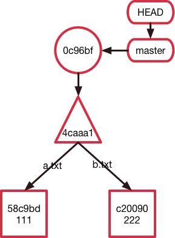
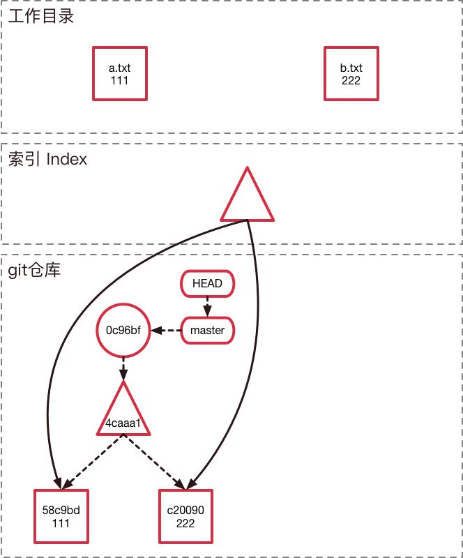

git init 自动创建了一个master分支。其中Master是默认就存在的一个分支，我们叫它主分支。一般很多人会觉得这个Master系统保留的分支应该有其特殊之处，但是实际上Master和其他分支一样没有啥特殊之处，无非他是必须有的分支，这个名称也可以通过git远程仓库修改默认配置，改为阿猫阿狗都没有问题。这个分支也可以删，但是需要特殊设置下。

**分支其实上就是一个指针**

最新的节点就是Branch的头部，从这个节点开始倒叙遍历，就能逐步遍历整个Branch

**Git保存文件的方式**

最下面的两个Git Object是blob类型的节点，存储的是文件的内容，然后将它们的哈希值作为标签

中间三角形的Git Object是tree，它将目录结构打了一个快照，存储的是文件名字、权限、正方形文件的哈希，

圆圈表示的Git Object是commit，它存储的是提交的信息、提交人，包括目录快照tree的Hash，以及上一个提交的Hash，这样可以用于从后向前遍历

add操作时，git仓库中新建了一个blob，存储新的文件内容，然后更新索引，并将索引产生一个新的树节点，最后更新分支master和Head的指向

为什么要把文件的权限和文件名存储在tree object 而不是 blog object?

因为如果存储在文件发生更改，则

Git在保存文件时，会将文本压缩，其中文本文件可以做到比较好的压缩，而二进制文件的压缩不明显，图片等难以压缩，因此版本迭代的特别快后，体积膨胀的很快。