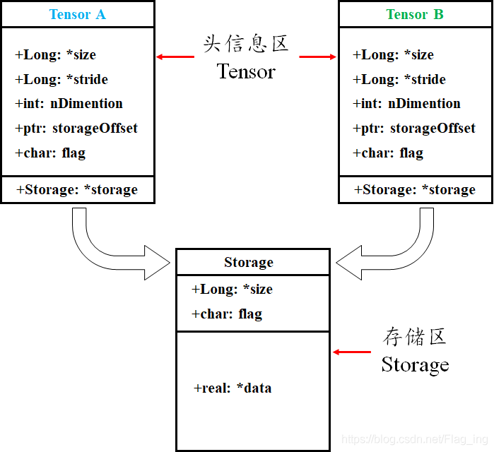

# pytorch源码解读

## Datasets

### Dataloader函数

* 设置参数的类型，并通过init函数进初始化
* 判断dataset的类型，并判断初始化参数的输入是否正确
  * IterableDataset
  * MapDataset
    * batch_sampler即采用auto_collation,与batch_size，shuffle，sampler和drop_last互斥，
    * 如果batch_size=None,则不采用auto_collation
    * **当采用batch_sampler时，直接继承父类Sampler。而不采用batch_sampler时，这里会自动利用sampler,batch_size和drop_last这三个参数去实例化一个继承父类Sampler的子类BatchSampler，其中sampler参数根据shuffle来选择RandomSampler还是SequentialSampler**
* 根据是否采用auto_collation决定collate_fn函数的形式

:pig:*以下为Dataloader可以作为迭代器的关键部分*：

* 在Dataloader的iter方法中返回了一个_get_iterator函数，即迭代器
* 因此定义了一个_get_iterator方法，目标是返回一个迭代器，包含单进程和多进程两种方法。

### DataLoaderIter函数

* 对于单进程SingleProcessDataLoaderIter，它继承于父类BaseDataLoaderIter，其中父类的初始化需要传入的参数为DataLoader类的实例，其中重要的参数：

  * _auto_collation:后续需要决定采样输出的形式，即若为False，为单个样本采样（*需要验证*）

  * _index_sampler:决定index的采样形式，如果\_auto_collation为True，则调用batch_sampler，否则调用sampler(这里sampler会根据shuffle选择采用random还是sequential)**为生成器**

    ==采用batch_sampler时，这些index最终以生成器的形式出现，当进行迭代时，每次产生一个batch_size大小的index（ 这里很重要，是产生一个放入list中的index序列）==

  * _sampler_iter:iter(self.\_index_sampler)这里调用了iter方法建立了一个迭代器

* 在父类中包含重要的三个方法：

  * _next_index:调用了\_sampler\_iter的next方法，得到下一组index
  * _next_data:需要在子类中实现，用于通过index获取数据
  * \_next\_：调用_next_data方法，获取包装好的一个batch_size的数据

* 子类继承父类的初始化方法，并完成如下两个任务：

  * 利用dataset_kind,dataset,auto_collation,collate_fn和drop_last参数得到一个dataset_fetcher用于从数据集中获取数据，对于MapDatasetFetcher，输入一个batch的索引，将数据集中对应的数据放入一个list中，并经过Collate函数的处理
  * 重写父类的_next_data方法，调用\_next\_index方法得到索引，输入到建立的dataset_fetcher中，并得到一个Batch的数据

  

### Collate函数

:star::该函数的作用在于将以List输入的数据转化为Tensor并补充一个Batch size的维度

**这里的数据是利用sampler拿出来的**

输入一个存放在List中的Batch大小的数据，并根据输入数据的第零个维度的数据类型进行相关操作：

- Tensor:此时一个Batch中的数据是放在一个List中，因此需要采用torch.stack函数，在第零维给这组数据增加一个Batch Size的新维度
- numpy:利用as_tensor转换为Tensor，再调用default_collate函数,按照上述Tensor的方式处理。如果只有一组数据，直接转换为Tensor
- Float\Int:直接调用torch.tensor


## module模块

### Module类

* register_buffer:为module增加一个buffer，用于存储module运行过程中的一些状态，常用的模块都会用到，但是代码已经封装好了。
* register_parameter:存储模型的参数
* 


## torch的view与reshape

版权声明：本文为CSDN博主「你卷我不卷」的原创文章，遵循CC 4.0 BY-SA版权协议，转载请附上原文出处链接及本声明。
原文链接：https://blog.csdn.net/Flag_ing/article/details/109129752

### 一、Pytorch中tensor的存储方式

#### 1、Pytorch张量存储的底层原理

tensor数据采用头信息区（Tensor）和存储区（Storage）分开存储的形式，如图1所示。变量名以及其存储的数据是分为两个区域分别存储的。比如，我们定义并初始化一个tensor，tensor名为A，A的形状size、步长stride、数据的索引等信息都存储在头信息区，而A所存储的真实数据则存储在存储区。另外，*如果我们对A进行截取、转置或修改等操作后赋值给B，则B的数据共享A的存储区*，存储区的数据数量没变，变化的只是B的头信息区对数据的索引方式。如果听说过浅拷贝和深拷贝的话，很容易明白这种方式其实就是*浅拷贝*。



#### 2、PyTorch张量的步长（stride）属性

这里步长可以理解为：某一维度连个间隔的索引之间的跨度


### 二、对“视图(view)”字眼的理解

视图是数据的一个别称或引用，通过该别称或引用亦便可访问、操作原有数据，但**原有数据不会产生拷贝**。如果我们对视图进行修改，它会影响到原始数据，物理内存在同一位置，这样避免了重新创建张量的高内存开销。

### 三、view() 和reshape() 的比较

#### 1、对 torch.Tensor.view() 的理解

定义：view(*shape) → Tensor

作用：类似于reshape，将tensor转换为指定的shape，原始的data不改变。返回的tensor与原始的tensor共享存储区。返回的tensor的size和stride必须与原始的tensor兼容。**每个新的tensor的维度必须是原始维度的子空间，或满足以下连续条件**：
$$
stride[i] = stride[i+1]\times size[i+1]
$$
若不满足，需要先使用**contiguous()**方法将原始tensor转换为满足连续条件的tensor，然后就可以使用view方法进行shape变换了。或者直接使用reshape方法进行维度变换，但这种方法变换后的tensor就不是与原始tensor共享内存了，而是被重新开辟了一个空间。

为了理解tensor的连续性条件，这里初始化一个张量：

```python
import torch
a = torch.arange(9).reshape(3, 3)  # 初始化张量a
print('struct of a:\n', a)
print('size   of a:', a.size())    # 查看a的shape
print('stride of a:', a.stride())  # 查看a的stride
 
'''   运行结果   '''
struct of a:
tensor([[0, 1, 2],
        [3, 4, 5],
        [6, 7, 8]])
size   of a: torch.Size([3, 3])
stride of a: (3, 1)   # 注：满足连续性条件
```

我们再看进一步处理——对a进行转置后的结果：

```python
import torch
a = torch.arange(9).reshape(3, 3)     # 初始化张量a
b = a.permute(1, 0)  # 对a进行转置
print('struct of b:\n', b)
print('size   of b:', b.size())    # 查看b的shape
print('stride of b:', b.stride())  # 查看b的stride
 
'''   运行结果   '''
struct of b:
tensor([[0, 3, 6],
        [1, 4, 7],
        [2, 5, 8]])
size   of b: torch.Size([3, 3])
stride of b: (1, 3)   # 注：此时不满足连续性条件
```

将a转置后再看最后的输出结果，带入到式1中，是不是发现等式不成立了？所以此时就不满足tensor连续的条件了。这是为什么那？我们接着往下看：

首先，输出a和b的存储区来看一下有没有什么不同：

```python
import torch
a = torch.arange(9).reshape(3, 3)             # 初始化张量a
print('ptr of storage of a: ', a.storage().data_ptr())  # 查看a的storage区的地址
print('storage of a: \n', a.storage())        # 查看a的storage区的数据存放形式
b = a.permute(1, 0)                           # 转置
print('ptr of storage of b: ', b.storage().data_ptr())  # 查看b的storage区的地址
print('storage of b: \n', b.storage())        # 查看b的storage区的数据存放形式
 
'''   运行结果   '''
ptr of storage of a:  2767173747136
storage of a: 
  0
 1
 2
 3
 4
 5
 6
 7
 8
[torch.LongStorage of size 9]
ptr of storage of b:  2767173747136
storage of b:
  0
 1
 2
 3
 4
 5
 6
 7
 8
[torch.LongStorage of size 9]
```

由结果可以看出，张量a、b仍然共用存储区，并且存储区数据存放的顺序没有变化，这也充分说明了b与a共用存储区，b只是改变了数据的索引方式。那么为什么b就不符合连续性条件了呐(T-T)？其实原因很简单，我们结合图3来解释下：


转置后的tensor只是对storage区数据索引方式的重映射，但原始的存放方式并没有变化.因此，这时再看tensor b的stride，从b第一行的元素1到第二行的元素2，显然在索引方式上已经不是原来+1了，而是变成了新的+3了，你在仔细琢磨琢磨是不是这样的(^-^)。所以这时候就不能用view来对b进行shape的改变了，不然就报错咯，不信你看下面：

```python
import torch
a = torch.arange(9).reshape(3, 3)             # 初始化张量a
print(a.view(9))
print('============================================')
b = a.permute(1, 0)  # 转置
print(b.view(9))
{
'''   运行结果   '''
tensor([0, 1, 2, 3, 4, 5, 6, 7, 8])
============================================
Traceback (most recent call last):
  File "此处打码", line 23, in <module>
    print(b.view(9))
RuntimeError: view size is not compatible with input tensor's size and stride (at least one dimension spans across two contiguous subspaces). Use .reshape(...) instead.
```

但是嘛，上有政策下有对策，这种情况下，直接用view不行，那我就先用contiguous()方法将原始tensor转换为满足连续条件的tensor，在使用view进行shape变换，值得注意的是，这样的原理是contiguous()方法开辟了一个新的存储区给b，并改变了b原始存储区数据的存放顺序！同样的例子：

```python
import torch
a = torch.arange(9).reshape(3, 3)      # 初始化张量a
print('storage of a:\n', a.storage())  # 查看a的stride
print('+++++++++++++++++++++++++++++++++++++++++++++++++')
b = a.permute(1, 0).contiguous()       # 转置,并转换为符合连续性条件的tensor
print('size    of b:', b.size())       # 查看b的shape
print('stride  of b:', b.stride())     # 查看b的stride
print('viewd      b:\n', b.view(9))    # 对b进行view操作，并打印结果
print('+++++++++++++++++++++++++++++++++++++++++++++++++')
print('storage of a:\n', a.storage())  # 查看a的存储空间
print('storage of b:\n', b.storage())  # 查看b的存储空间
print('+++++++++++++++++++++++++++++++++++++++++++++++++')
print('ptr of a:\n', a.storage().data_ptr())  # 查看a的存储空间地址
print('ptr of b:\n', b.storage().data_ptr())  # 查看b的存储空间地址
 
'''   运行结果   '''
storage of a:
  0
 1
 2
 3
 4
 5
 6
 7
 8
[torch.LongStorage of size 9]
+++++++++++++++++++++++++++++++++++++++++++++++++
size    of b: torch.Size([3, 3])
stride  of b: (3, 1)
viewd      b:
 tensor([0, 3, 6, 1, 4, 7, 2, 5, 8])
+++++++++++++++++++++++++++++++++++++++++++++++++
storage of a:
 0
 1
 2
 3
 4
 5
 6
 7
 8
[torch.LongStorage of size 9]
storage of b:
 0
 3
 6
 1
 4
 7
 2
 5
 8
[torch.LongStorage of size 9]
+++++++++++++++++++++++++++++++++++++++++++++++++
ptr of a:
 1842671472000
ptr of b:
 1842671472128
```

由上述结果可以看出，张量a与b已经是两个存在于不同存储区的张量了。也印证了**contiguous()**方法开辟了一个新的存储区给b，并改变了b原始存储区数据的存放顺序。**对应文章开头提到的浅拷贝，这种开辟一个新的内存区的方式其实就是\**深拷贝\**。**

#### 2、对 torch.reshape() 的理解

定义：torch.reshape(input, shape) → Tensor

作用：与view方法类似，将输入tensor转换为新的shape格式。

但是reshape方法更强大，可以认为a.reshape = a.view() + a.contiguous().view()。

即：在满足tensor连续性条件时，a.reshape返回的结果与a.view()相同，否则返回的结果与a.contiguous().view()相同。

### 四、总结

torch的view()与reshape()方法都可以用来重塑tensor的shape，区别就是使用的条件不一样。view()方法只适用于满足连续性条件的tensor，并且该操作不会开辟新的内存空间，只是产生了对原存储空间的一个新别称和引用，返回值是视图。而reshape()方法的返回值既可以是视图，也可以是副本，当满足连续性条件时返回view，否则返回副本[ 此时等价于先调用contiguous()方法在使用view() ]。因此当不确能否使用view时，可以使用reshape。如果只是想简单地重塑一个tensor的shape，那么就是用reshape，但是如果需要考虑内存的开销而且要确保重塑后的tensor与之前的tensor共享存储空间，那就使用view()。

