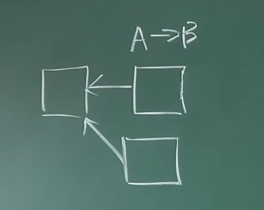

## 1、密码学原理

密码学中使用的哈希函数被称为cryptographic hash function，它有两个重要性质，collision resistance/collision free，即没有什么高效的方法人为制造哈希碰撞，只能brute-force，遍历所有可能，实际不可能，因为工作量太大了，因此用来检测文件是否被篡改。但这个性质是无法被理论证明出来的。hiding，即哈希函数的计算过程是单向的，不可逆的，它成立的条件是输入空间足够大且分布均匀，使得蛮力求解基本不可能。上述两个性质结合在一起，可以用来实现digtial commitment/digtial equivalent of a sealed envelop。比特币中用到的哈希函数还有第三个性质，puzzle friendly，即哈希值的分布是无法预估的。

比特币是一个一个区块链组成的链表，每一个链表有一个块头block header，其中有一个我们可以设置的随机数nonce，为4bytes，使得Hash(block header)<target，这就是挖矿的过程。puzzle friendly这条性质表明挖矿的过程没有捷径，只能不停试大量的nonce，所以才能作为工作量证明。挖矿很难，验证很容易，即difficult to solve,but easy to varify。

比特币中用的哈希函数为SHA-256(Secure Hash Algorithm)

比特币中的账户管理：开户的过程就是创立一个公钥public key和私钥preivate key对，公钥和私钥来自非对称加密体系，asymmetric encryption algorithm。对于对称加密体系，有一个encyption key，通讯双方拥有，但是密钥的分发不方便。而非对称加密体系，采用接收方的公钥加密，接收方的私钥解密。发布交易后，签名采用个人私钥，其他人可以用公钥去验证。这里我们假设擦产生公私钥的过程是有一个好的随机源。

比特币中一般是先对一个message取Hash，在对这个Hash用私钥签名

利用数字签名来证明Alice是Alice：

上述情况存在很多漏洞，这里用户名是通过私钥加密，攻击者可以采用自己的私钥和公钥直接进行伪造，关键点就在于，虽然服务器可以解密出签名的明文用户名，但是服务端不知道用户名和消息中的公钥是不是属于同一个人，也就是说服务端不知道Alice的公钥是什么，当然也不知道Carol的公钥是什么？所以Carol可以用自己的私钥来签署用户名为Alice的签名。服务端用Carol的公钥来解密这个签名自然可以解开。即如下情况

因此，如果能够舍弃用户名，直接将公钥替代用户名，并作为账户地址，并且添加一个验证逻辑，即可避免造假的出现。

1.Carol创建一条虚假的交易数据：“公钥A to 公钥C 40”，意思就是Alice的公钥转账给Carol的公钥40个Bitcoin。

2.Carol用自己的私钥加密Alice的公钥A，得到一个伪造的签名：“f9293ued3“。

3.然后将公钥C＋伪造的签名＋伪造的交易数据，放入消息中，通过网络发送给Bitcoin服务端。

4.服务端收到消息，解析后得到三个部分：公钥、签名、交易数据。

5.服务端利用Carol的公钥来解密Carol伪造的签名，得到明文的用户名：“公钥A”（即，Alice的公钥）。

6.服务器开始验证逻辑：比较消息中的公钥C和签名中解密出来的公钥A是否相等，显然这俩个公钥不相等，所以可以认定这笔交易不合法。

7.服务端拒绝继续处理，交易无效。
这样就解决了上面的漏洞，只需要将签名由加密用户名，改为加密公钥。(见下图)

**将签名加入到交易模型中**

中本聪在脑子里又模拟运行了几遍系统，忽然又出现了一个灵感：“现在的消息由三个部分组成：公钥，签名，交易数据。这里可以优化一下，首先可以去掉消息中的公钥参数，因为它和交易数据中的付款方公钥重复了。另外消息中的签名参数也可以去掉，我们将签名放入到交易数据中，变更下交易的模型，增加一个签名字段，这样签名就作为交易数据的一部分，可以被写入账本中，永远可查。”

Gilfoyle说：“这样的改动十分合理！交易模型中增加签名字段是很必要的，因为每笔交易的签名应该和交易的业务数据一起存储，并且永不分开。就好比欠条中的描述文字和签名不可分开一样，如果分开就等于欠条被撕成了两半，不再具备法律效应。”（见下图）

“到此为止，用户名就没有任何用处了，因为公钥可以替代用户名，user.txt也就没有存在的意义了，终于可以彻底舍弃账户模型了！”中本聪终于把用户注册的问题给根本性的解决了。

Gilfoyle说：“我们可以将用户的公钥理解成收款的地址，而不仅仅看成是用户名，虽然本质上他们是一个意思”。

“这个认知很棒！就像我订报纸的时候，不必告诉送报纸的人我的真名叫什么，我只要告诉他我的邮寄地址就可以啦。将公钥理解成收款地址而非用户名，的确更符合日常的生活经验。”

“我准备开始编码了，升级到只有账本模型的新版本”，中本聪一边说着一边打开电脑，迅速的敲打起来。

但是，当前的设计是存在设计漏洞的，因为每次用户的签名不变，所以存在被重复使用的漏洞。例如Alice付款给Carol了50个Bitcoin，那么Carol就有动机，将这笔交易数据截获，并重复多次的向服务端发起相同的请求，服务端就会误以为Alice自愿支付多次50Bitcoin给Carol，直到Alice的余额减少到小于50bitcion。

这就涉及到后续UTXO的概念。

## 2、BTC-数据结构

hash pointers:既要存一个结构体的地址，也要保存内容，这样可以检测结构体是否被篡改。

Block chain:是一个采用哈希指针的链表

Merkle tree:如下图。作用是提供Merkel proof，复杂度是$O(log(n))$。系统中存在block header和block body，后者保留着包括交易在内的全部信息，而前者只保留根哈希值

手机端等轻节点只保留根哈希值，为了验证黄色的交易是否被记录，它需要算出所有绿色的哈希值，并与系统中的根哈希值比较。

## 3、BTC-协议

如果仅采用由央行发布货币的公钥私钥体系的数字货币，会有double speending attack，只需要复制签名后的货币即可。而去中心化货币，最重要的就是决定货币的发行体系。

对于每一个区块，包含header和body
block header包含如下信息：

* version
* hash of previous block header
* Merkle root hash
* target（即挖矿时需要满足的目标函数）
* nonce

Block body中包含：

* transaction list交易列表

全节点full node保存所有信息，轻节点light node只保存blcok header信息。

distributed consensus 分布式共识，其中包含很多impossibility result.比如FLP：在一个异步系统中，网络时延没有上限，即使一个成员有问题，也不可能取得共识。CAP(Consistency,Availability,Partition tolerance) Theorem:在一个分布式系统中，最多满足两种性质。分布式共识比较著名的协议时Paxos，可以达成一致性。

Consensus in BitCoin:假设系统中有恶意的节点是少的，比特币系统中写入区块链也是采用投票模式，但是不是依照节点数的多少，而只依赖于算力的大小，称为hash rate，即只有找到这个nonce，获取记账权，它才有权利发布下一个区块，其它节点收到这个区块后验证一下这个节点的合法性，先检查block header，是否满足target设置的条件，再检查block body中的交易是否都是合法的。并且协议规定接收的区块应该是在扩展最长合法链，因此分叉的区块是不合法的。如果两个矿工基本同时发布一个新的区块，那谁先找到下一个合法区块，谁可以保留下来，而另一个就被丢弃掉。

为什么要争夺记账权(挖矿mining)？

* block reward:比特币协议中规定获得记账权的节点，在发布的区块中可以有一个特殊的交易，即铸币交易coinbase transaction，可以发布一定数量的比特币，且是产生新的比特币的唯一方法。最早为50BTC，协议中规定21万个区块后，奖励减半。
* transaction fee:类似于手续费

## 4、BTC-实现

transaction-based ledger

比特币的全节点要维护一个叫UTXO（Unspent Transaction Output）的数据结构，必须满足total inputs=total outputs。比特币没有账户的概念，所以每个交易必须说清楚币的来源

account-based ledger

以太坊就是这样的，是有账户记账，不用显示说明币的来源

挖矿的过程每一次尝试可以看作一个Bernoulli trail:a random experiment with binary outcome.多次就构成了一个Bernoulli process:a sequence of independent Bernoulli trials。伯努利实验的特点是无记忆性memoryless。由于试验次数很多，成功的概率很小，上述伯努利过程可以用泊松过程近似，区块产生的时间服从指数分布。通过定期调整挖矿难度，使得平均时间为10分钟。是progress free，即未来的结果与过去无关，这样保证算力的强弱不影响挖矿的成功率。

#### BTC的数量

21万\*50+21万\*25+21万\*12.5.......=2100万，这就是系统中所有比特币的总量。因此比特币求解puzzle是纯粹算力的体现，而比特币的数量由区块奖励决定了，它的稀缺性是人为造成的。挖矿的过程对维护比特币系统的安全性是至关重要的，Bitcoin is secured by mining，因为挖矿提供了一种凭借算力投票的手段。

对于有恶意的节点，如果获得了记账权，也无法伪造交易，因为无法获得别人的签名，变成了一个非法区块。则诚实的不会接收这个交易，仍然按照上一个区块挖。

比特币协议中需要等待后面六个区块生成后，才会确认这个区块的有效性。

## 5、BTC-网络

比特币工作在应用层，运行比特币协议，底层网络层运行P2P Overlay Network，它的P2P网络所有节点对等。要想加入，先知道种子节点seed node。它的设计原则是简单、鲁棒而不是高效，消息传播在网络中采取flooding，节点第一次听到某个消息，转发给邻居节点，以后再收到就不用转发了。每个节点要维护一个等待上链的交易的集合。比特币区块的限制为1M字节，每个新发布的区块可能要几十秒才能传到每个节点。

## 6、BTC-挖矿难度

挖矿本身就是不断尝试block header中的nance，使整个block header的哈希值小于target。挖矿难度和目标阈值是成反比的。而出块时间不能太短，因为区块在节点中的传播还需要时间，太短的话会出现分叉，并且可能是多分叉，成为一种常态，这样系统中的总算力就被分散了，而有恶意的节点可以集中算力扩展它的分叉，可以很快使得它变成最长合法链。

*如何调整挖矿难度？：*比特币中规定每2016个区块，大约14天时间调整一次难度，按照公式$target=target\frac{actual\;time}{expected\;time}$，actual time为挖出前2016个区块需要的时间，时间短，则让target变小，增加难度，这些是写在比特币系统的代码中的。如果恶意节点不调整难度，在发布的区块中包含一个target的压缩编码nbits，是4位的，这样在检查过程中是不通过的。

## 7、BTC-挖矿

#### 全节点

* 一直在线
* 在本地硬盘上维护完整的区块链信息
* 在内存里维护UTXO集合，以便快速检验交易的正确性
* 监听比特币网络上的交易信息，验证每个交易的合法性
* 决定哪些交易会被打包到区块里
* 监听别的矿工挖出来的区块，验证其合法性：1、区块中的每个交易都要合法 2、发布的区块是否符合难度要求，即blockheader取哈希后看看前面是否有足够多的零 3、blockheader里的难度目标阈值是否设置正确 4、是否是沿着最长合法链
* 挖矿
  * 决定沿着哪条链挖下去？缺省情况下沿最长合法链
  * 当出现等长的分叉的时候，选择哪一个分叉？缺省情况下选择最先听到的分叉

#### 轻节点

* 不是一直在线
* 不用保存整个区块链，只要保存每个区块的块头
* 不同保存全部交易，只保存与自己相关的交易
* 无法检验大多数交易的合法性，只能检验与自己相关的那些交易的合法性
* 无法检测网上发布的区块的正确性
* 可以验证挖矿的难度
* 只能检测哪个是最长链，不知道哪个是最长合法链

设备：CUP、GPU、现在一般用ASIC(Application Specific Integrated Circuit)芯片挖矿，且一个芯片一般只为一个加密货币服务

有些新的加密货币涉及Alternative mining puzzle，目的是ASIC resistance，让一般的设备也可以参与挖矿。

矿池：矿工只负责计算哈希值，而全节点的其它功能由矿主实现。矿池有两种组织方式：1、矿机全部属于同一机构 2、矿工和矿主是分布式的，只是按照矿池规定的通讯协议，矿主分配任务，在有初块奖励的时候一起参与分红，按照矿工的贡献大小。

假设某个矿池占据了半数以上的算力，它可以发动

1、分叉攻击

上面的链为正常的合法链，并且已经经过六个区块的验证，但是如果某个矿池的算力足够大，从理论上说，下面这条攻击链的增长速度是比上面快的，也就意味着它最终会成为最长合法链，原始链中A转给B，而在攻击链中A将比特币转给自己，但是B此时已经收到验证的消息了，即如果是实体行业，B它可能已经发货了，此时攻击链将原始合法链替代，就完成了攻击。

2、Boycott

如果攻击者拥有半数以上的算力，它每次发布区块的时候都不包含A的交易，这样经常会出现分叉，使得别的矿工为了保险起见，当区块中存在A的时候就不继续挖了，而是选择接着不存在A的那个区块中挖。

*注意，由于私钥只有自己拥有，因此就算它的算力再强，也不可能出现盗币。因为当它选择盗币时，这个区块就会发生分叉，总有诚实的矿工按着原来正确的路径挖下去*

## 8、BTC-比特币脚本

比特币脚本语言很简单，只有一个栈。

## 9、BTC-分叉

分叉包括：

* state fork
* protocal fork：对比特币协议修改的意见不同造成的分叉。根据对协议修改的内容的不同，还可以分为硬分叉和软分叉
  * hard fork
  * soft fork

#### hard fork

*必须所有节点都要更新节点系统中才不会出现永久性分叉*

一个例子是block size limit，规定是1M字节，有些人认为它太小，平均每个交易250个字节的话，每个区块有1M/250=4000个交易，每个区块的生成时间为10分钟，则每秒产生的交易为7个。假设有人发布更新从1M到4M，系统中拥有大多数哈希算力的节点都更新了软件。对于选择新的区块大小的节点，它生成的节点也有可能是小于1M的，但是没有更新软件的节点仍然无法接着它挖，因为当这些节点要去验证链的正确性时，前面会出现一些4M的区块，在它看来是非法区块，因此只要系统中存在部分保守不愿意更新软件的人，则硬分叉是一定会存在的。

此时的分叉会产生彼此独立的加密货币，即社区分裂了。比如ETH和ETC，实际上ETC是最原始的。但是由于分裂后私钥公钥仍然不变，为了进行区分，会加入chain ID，两条链独立运行。

#### soft fork

*只要系统中超过半数的节点更新了软件，就不会出现永久性分叉*

对比特币协议加一些限制，原来合法的交易或者区块在新的协议中变得不合法了，比如有人把区块大小变小了，1M到0.5M，假设大多数人认为是0.5M，少数仍保留认知为1M。由于新节点只认小区块，并且其算力占大多数，导致旧节点挖出的大区块白挖了。但是这种分叉不会是永久性的，这就是软分叉。

实际当中可能出现软分叉的情况：

每个发布的区块中有一个铸币交易，coinbase transaction，这其中有个域叫coinbase域，一般也没人检查，有时候会作为extra nance。因为在计算时，blockheader中的nance值只有4bytes，即$2^{32}$的搜索空间大小，相对比较小，因此实际中可以把coinbase中的前八个字节也作为extra nonce，这样搜索空间变为$s^{96}$，剩下的字节有人提出作为UTXO的根哈希值。UTXO是在每个全节点自己存储的，而不在区块链中，与Merkel proof不同。也就是说可以把UTXO也组成一个Merkel tree，将UTXO的根哈希值保存在coinbase中，而由于在blockheader中的Merkle root hash是根据每一笔transaction计算而来，而coinbase transaction的信息自然也就会被传递上去。*此时，新节点发布的区块，旧节点是认的，因为它不管你在coinbase域中写入的内容，而旧节点发布的区块，新节点是不认的*

比特币历史上比较著名的软分叉例子是P2SH:Pay to Script Hash，即你支付的时候不是付给一个public key的hash，而是一个赎回脚本的hash。输入脚本给出的redeem Script和输出脚本的Script的哈希值是对的上的，再执行redeem script，验证签名是合法的。

## 10、BTC-问答

转账交易不需要接收者在线

比特币账户在创建的时候是不需要通知所有节点的，只有当它第一次收到钱的时候，其它节点才知道它的存在

交易所是中心化的机构，开户一般要提供身份证明，私钥实际上是由交易所保管，这种情况下如果密码丢失是可以和交易所联系找回密码，而如果是自己的私钥丢失，是没办法找回账户的

如果发现私钥泄露，尽快把钱转到安全账户上

如果转账写错地址，是无法取消已经发布的交易

如何确定是哪个矿工先找到nance？在发布的区块中有一个coinbase transaction，里面有一个地址，是挖到这个区块的收款地址，而如果有人要偷答案，要把这个收款地址变掉，则这个coinbase域就发生了变化，会导致Merkle Tree的根哈希值会发生变化，造成blockheader也变了，这时候找到的Hash就不会满足条件了。

## 11、BTC-匿名性

有人认为比特币是pseudonymity，它不是一种真的匿名，一旦与现实世界交互，就会泄露信息。

### 零知识证明

指一方(证明者)向另一方(验证者)证明一个陈述是正确的，而无需透露除该陈述是正确的外的任何信息

## 12、BTC-思考

我们通过哈希指针构建一个链表，我们将这个数据结构称为区块链（block chain）。在普通链表中有一系列区块，每个区块既有数据也有一个指向上一个区块的指针。而在区块链中，上一个区块指针被置换为哈希指针。因此，每个区块不仅能告诉我们上一个区块的值在哪里，还包含了该值的摘要，使我们能够验证那个值没有改变。我们存储链表头部（the head of list），即一个普通的哈希指针指向最近使用的数据区块。 实际系统中用的时候只有哈希，没有指针。全节点将区块的哈希和内容存储在一个(key,value)数据库中，常用的为levelDB,只要直到最后一个区块的内容，就可以在这个数据库中查找出来，而这个区块中又包含上一个区块的哈希值，以此类推，可以得到整个区块链。

对于多个人的共享账户，应该采用多重签名，而不是截断私钥，因为截断私钥以后，安全性的下降是指数级的。

比特币并没有取得真正意义上的分布式共识。

## 13、ETH-以太坊概述

最大的改进是挖矿使用的mining puzzle，比特币的是计算密集型，造成挖矿设备的专业化。以太坊设计的mining puzzle是memory hard的，是ASIC resistance，并采用权益证明POS(state)替代工作量证明POW，并且加入smart contract。

比特币是一种去中心化的货币，很多人在考虑其它东西是否也能去中心化?因此以太坊加入了去中心化合约，由区块链的不可篡改性，保证不能违约。

## 14、ETH-账户

以太坊采用的是基于账户的模型，可以解决比特币中的double spending问题。但自身仍会有replay attack，即收钱的人在收到钱之后，把交易再广播一次，而在比特币中不会出现的原因是在重放交易时，UTXO中的币已经花出去了，矿工会认为这是非法交易。以太坊加入一个nonce，为交易次数，除了要维护交易本身，同时还要维护交易的次数。这时候每次发布交易的时候，A签名的内容中是包含这个nonce的，因此如果再一次发布这个交易时，矿工会知道此时这个交易已经发生过一次了。

ETH中有两类账户，一类叫外部账户externally owned account，包含余额balance和nance，和比特币一样都是通过公私钥对来控制的，第二类账户为合约账户smart contract account，它不能主动发起交易，它包含余额banlance，计数器nance，代码code，存储storage，创建合约时会产生一个地址，通过这个地址调用合约。有人提出采用只能合约实现一些金融衍生品，

