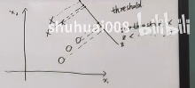
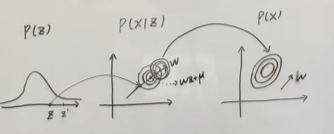

## 频率派VS贝叶斯学派

### 频率学派

把模型中的参数$\theta$当做未知常数，问题的核心是如何求解出这个常数
$$
\text{MLE}=\mathop{argmax}\limits_{\theta}\;\;logP(x|\theta)
$$

### 贝叶斯学派

认为模型中的参数$\theta$是服从一定的分布的，并且会给出它的先验分布$P(\theta)$，最核心的地方在于贝叶斯公式
$$
P(\theta|x)=\frac{P(x|\theta)*P(\theta)}{P(x)}=\frac{P(x|\theta)*P(\theta)}{\int_{\theta}P(x|\theta)*P(\theta)}
$$
似然$P(x|\theta)$和先验$P(\theta)$通常是给定的，而$P(x)$往往才是最难计算的，因为可能由于分布本身复杂，参数的维度高或者分布太广，因此会有各种办法来逼近这个后验。

为什么要算后验概率？

例如在贝叶斯预测中，在来了一个新数据$\hat{x}$后，要判断在已有数据的情况下，这个新数据出现的概率$P(\hat{x}|X)$，那么可以用$\theta$作为模型的一个中间量，表示为$X\rightarrow\theta\rightarrow\hat{x}$
$$
P(\hat{x}|X)=\int_{\theta}P(\hat{x},\theta|X)=\int_{\theta}P(\hat{x}|\theta)P(\theta|X)
$$
不难看出，这里参数的后验概率$P(\theta|X)$就极为重要

## 关于多元高斯分布的一些知识

### 已知联合概率分布$P(X_1,X_2)$，求条件概率分布$P(X_1|X_2)$

考虑$X=(X_1,X_2)^T$的联合概率密度，假设均值满足$\mu=(\mu_1,\mu_2)$，协方差满足
$$
\Sigma=
\begin{pmatrix}

\Sigma_{11} & \Sigma_{12} \\
\Sigma_{21} & \Sigma_{22} \\

\end{pmatrix}
$$
则联合概率密度可以写为
$$
P(X_1,X_2)=\frac{1}{\sqrt {\det( \Sigma)}(2\pi)}exp(-\frac12(X- \mu)^T \Sigma^{-1}( X- \mu))
$$
对$\Sigma$施加初等行变换矩阵和列变换矩阵，可以求得它的逆，即
$$
\Sigma^{-1}=
\begin{pmatrix}

I & 0 \\
-(\Sigma_{12}\Sigma_{22}^{-1})^T & I \\

\end{pmatrix}

\begin{pmatrix}

(\Sigma_{11}-\Sigma_{12}\Sigma_{22}^{-1}\Sigma_{21})^{-1} & 0 \\
0 & (\Sigma_{22})^{-1} \\

\end{pmatrix}
\begin{pmatrix}

I & -\Sigma_{12}\Sigma_{22}^{-1} \\
0 & I \\

\end{pmatrix}
$$
带入式(5)，花间括号内的部分有
$$
\begin{aligned}
(X- \mu)^T \Sigma^{-1}( X- \mu)&=
\begin{pmatrix}

X_1-\mu_1  \\
X_2-\mu_2  \\

\end{pmatrix}
^T
\begin{pmatrix}

I & 0 \\
-(\Sigma_{12}\Sigma_{22}^{-1})^T & I \\

\end{pmatrix}

\begin{pmatrix}

(\Sigma_{11}-\Sigma_{12}\Sigma_{22}^{-1}\Sigma_{21})^{-1} & 0 \\
0 & (\Sigma_{22})^{-1} \\

\end{pmatrix}
\begin{pmatrix}

I & -\Sigma_{12}\Sigma_{22}^{-1} \\
0 & I \\

\end{pmatrix}
\begin{pmatrix}

X_1-\mu_1  \\
X_2-\mu_2  \\

\end{pmatrix}\\
&=
\begin{pmatrix}

(X_1-\mu_1)^T-(\Sigma_{12}\Sigma_{22}^{-1}(X_2-\mu_2))^T &(X_2-\mu_2)^T\\

\end{pmatrix}

\begin{pmatrix}

(\Sigma_{11}-\Sigma_{12}\Sigma_{22}^{-1}\Sigma_{21})^{-1} & 0 \\
0 & (\Sigma_{22})^{-1} \\

\end{pmatrix}
\begin{pmatrix}

(X_1-\mu_1)-\Sigma_{12}\Sigma_{22}^{-1}(X_2-\mu_2) \\
X_2-\mu_2 \\

\end{pmatrix}\\
&=
\begin{pmatrix}

X_1-\hat{\mu}_1  \\
X_2-\mu_2  \\

\end{pmatrix}
^T

\begin{pmatrix}

(\Sigma_{11}-\Sigma_{12}\Sigma_{22}^{-1}\Sigma_{21})^{-1} & 0 \\
0 & (\Sigma_{22})^{-1} \\

\end{pmatrix}

\begin{pmatrix}

X_1-\hat{\mu}_1  \\
X_2-\mu_2  \\

\end{pmatrix}\\
\end{aligned}
$$
不难看出，$P(X_2)$在式(7)中对应着二次型结果的后半部分，因此条件概率分布仍然为高斯分布，$\mathcal N(\mu_1-\Sigma_{12}\Sigma_{22}^{-1}(X_2-\mu_2),\Sigma_{11}-\Sigma_{12}\Sigma_{22}^{-1}\Sigma_{21})$

### 已知$P(X)=\mathcal N(x|\mu,\Lambda^{-1}),P(y|x)=\mathcal N(y|Ax+b,L^{-1})$，求$P(y),P(x|y)$

这里不加证明地给出，上述分布全部为高斯分布，因此只需要求均值和方差。上述条件等价为
$$
Y=Ax+b+\epsilon,\;\;\epsilon\sim\mathcal{N}(0,L^{-1})
$$
则相应的期望和方差为
$$
E(Y)=E(Ax+b+\epsilon)=A\mu+b
\\
D(Y)=A\Lambda^{-1}A^{-1}+L^{-1}
$$
对于多元高斯分布，它的特征函数可以写为
$$
\phi_{y}(\omega)=exp(j\omega^T\mu-\frac{1}{2}\omega^T\Sigma\omega)
$$
则根据特征函数的定义，令$Y=AX$
$$
\begin{aligned}
E(exp(j\omega^	T Y))&=E(exp(j\omega^T AX))\\
&=E(exp(j(A^T\omega)^TX))\\
&=exp(j(A^T\omega)^T\mu-\frac{1}{2}(A^T\omega)^T\Sigma(A^T\omega))\\
&=exp(j\omega^TA\mu-\frac{1}{2}\omega^TA\Sigma A^T\omega)\\
\end{aligned}
$$
则$Y\sim N(A\mu,A\Sigma A^T)$

要计算$P(x|y)$，根据上一节的知识，希望先计算$P(x,y)$，仍然是假设为二维高斯分布，则均值和方差已经知道，核心是计算协方差矩阵$\Sigma_{xy}$
$$
\begin{aligned}
conv(x,y)&=E[(x-\hat{x})(y-\hat{y})^T]\\
&=E[(X-\mu)(AX+b+\epsilon-A\mu)^T]\\
&=E[(X-\mu)(AX-A\mu)^T]+E[(X-\mu)(b+\epsilon)^T]\\
&=E[(X-\mu)(X-\mu)^TA^T]\\
&=\Lambda^{-1} A^T
\end{aligned}
$$

## 三-线性回归

### 最小二乘法

假设有数据$D={(x_1,y_1)...(x_N,y_N)}$，$x_i\in \mathbb R^p,y_i\in \mathbb R,i=1,...,N$，每一个样本为列向量，定义整体样本
$$
X=(x_1,x_2,...,x_N)^T=
\begin{pmatrix}
x_1^T\\
x_2^T\\
\vdots\\
x_N^T
\end{pmatrix}=
\begin{pmatrix}
x_{11} &x_{12}&\cdots &x_{1p}\\
x_{21} &x_{22}&\cdots &x_{2p}\\
\vdots & \vdots & &\vdots\\
x_{N1} &x_{N2}&\cdots &x_{Np}\\
\end{pmatrix}
_{N*P}
$$

$$
Y=
\begin{pmatrix}
y_1\\
y_2\\
\vdots\\
y_N
\end{pmatrix}
_{N*1}
$$

定义回归曲线为
$$
f(x)=w^Tx
$$
其中$w=(w_1,w_2,...,w_p)^T$，这里不用带入偏置$b$，原因在于如果令样本中加入一个$x_1=1$，使$w_0=b$即可，因此模型的形式不变。

则定义出误差函数
$$
\begin{aligned}
L(w)&=\Sigma(w^Tx_i-y_i)^2\\&=(W^TX^T-Y^T)(XW-Y)\\
&=W^TX^TXW-W^TX^TY-Y^TXW+Y^TY\\
&=W^TX^TXW-2W^TX^TY+Y^TY
\end{aligned}
$$
优化过程
$$
\frac{\partial L}{\partial W}=2X^TXW-2X^TY=0\\
\hat{W}=(X^TX)^{-1}X^TY
$$
几何解释1：即让$y$这个轴上的误差平方和最小，

几何解释2：式(15)还可以表示为
$$
f(x)=w^Tx=x^T\beta
$$
对于样本矩阵，竖着看为一组，即把每个维度的数据当成一组数据，则变成了P个N维的数据，实际上构成了一个P维空间，通常N>>P，那么就变成了一个在高维空间的超平面，Y形成的向量不在这个P维空间中，因为存在各种噪声，因此在这个P维空间中找到一个对应于Y的曲线，使得Y离它最近，那显然是Y到这个空间的投影
$$
X^T(Y-X\beta)=0
$$
同样可以得到
$$
\beta=(X^TX)^{-1}X^TY
$$

### 从概率视角看线性回归

假设噪声$\epsilon\sim\mathcal{N}(0,\sigma^2)，$$y=W^Tx+\epsilon$，那么y的条件分布为
$$
y|x,w\sim\mathcal{N}(W^Tx,\sigma^2)
$$
采用MLE极大似然估计,假设样本独立同分布
$$
\begin{aligned}
L(W)&=logP(Y|X,W)=log\prod P(y_i|x_i,W)\\
&=log\prod\frac{1}{\sqrt{2\pi}\sigma}exp(-\frac{(y_i-W^Tx_i)^2}{2\sigma^2})\\
&=\sum log\frac{1}{\sqrt{2\pi}\sigma}-\sum \frac{(y_i-W^Tx_i)^2}{2\sigma^2}
\end{aligned}
$$
可以看出，上述优化问题等价于
$$
argmin\;\;\sum(y_i-W^Tx_i)^2
$$
这与最小二乘法法的优化过程是完全一样的，因此*最小二乘估计是建立在噪声服从高斯分布的*

### 正则化-岭回归-频率角度

正常情况下，N>>P，但是有时候样本点不够，导致(X^TX)不可逆，现象上是造成过拟合

常见的解决过拟合的办法有：

* 增加数据
* 特征选择/特征提取(PCA等)
* 正则化

首先引入L2正则化$P(W)=W^TW$，即岭回归，又叫权值衰减
$$
\begin{aligned}
L(W)&=\sum(y_i-W^Tx_i)^2+\lambda W^TW\\
&=W^TX^TXW-2W^TX^TY+Y^TY+\lambda W^TW
\end{aligned}
$$

$$
\frac{\partial L}{\partial W}=2(X^TX+\lambda I )W-2X^TY=0\\
W=(X^TX+\lambda I)^{-1}X^TY
$$

已知$X^TX$半正定，$\lambda>0$，因此矩阵一定可逆

### 正则化-岭回归-贝叶斯角度

给参数$W$一个先验，为了简化计算，先给定为零均值，即$W\sim \mathcal N(0,\sigma_0^2)$，而此时仍然假设噪声$\epsilon\sim\mathcal{N}(0,\sigma^2)，$$y=W^Tx+\epsilon$，则$y|x,W\sim \mathcal N(W^Tx,\sigma^2)$

采用最大后验估计MAP，简化计算，考虑单一样本
$$
\begin{aligned}
W&=argmax\;\;P(W|y)=\frac{P(y|W)P(W)}{P(y)}\\
&=argmax\;\;log\prod P(y_i|W)P(W)\\
&=argmax\;\;log\prod\frac{1}{\sqrt{2\pi}\sigma}exp(-\frac{(y_i-W^Tx_i)^2}{2\sigma^2})\frac{1}{\sqrt{2\pi}\sigma}exp(-\frac{||W||^2}{2\sigma_0^2})\\
&=argmax\;\;\sum-\frac{(y_i-W^Tx_i)^2}{2\sigma^2}-\frac{||W||^2}{2\sigma_0^2}\\
&=argmin\;\;\sum(y_i-W^Tx_i)^2+\frac{\sigma^2}{\sigma_0^2}||W||^2
\end{aligned}
$$
这里与式(24)的优化目标完全一样

### 总结

* **LES最小二乘估计$\Longleftrightarrow$MLE极大似然估计(在Noise为gaussion分布时)**

* **Regularized LSE$\Longleftrightarrow$ MAP最大后验概率估计(Prior和Noise为gaussion分布时)**

## 四、线性分类

线性回归$\rightarrow$加入激活函数或者降维$\rightarrow$线性分类，包含硬分类和软分类。

* 硬分类：$y\in \{0,1\} $线性判别分析（fisher判别分析）、感知机等，与概率无关
* 软分类：$y\in[0,1]$ 生成式：连续数据Gaussian Discriminant Analysis(GDA)，离散数据Navie Bayes 利用贝叶斯定理学习$P(Y|X)$ 判别式：逻辑回归，直接学习$P(Y|X)$，

### 感知机

假设数据是线性可分的，原理是错误驱动，模型$f(x)=sign(w^Tx)$，都是P维。先给W一个初始值，将被错误分类的样本放入一个集合D中，将损失定义为被错误分类点的个数
$$
L(w)=\sum I(y_iw^Tx_i<0)
$$
但是这个函数是非连续函数，无法求解，因此
$$
L(w)=\sum_{x_i\in D} -y_iw^Tx_i
$$
此时可以直接求导，利用SGD更新参数

### 线性判别分析

$\{(x_i,y_i)\}_{i=1}^{N},x_i\in\mathbb R^p,y_i\in \{+1,-1\},x_{c_1}=\{x_i|y_i=1\},x_{c_2}=\{x_i|y_i=-1\},|x_{c_1}=N_1|,|x_{c_1}=N_2|$

思想：类内小，类间大。从降维的角度出发，希望把数据全部投影到某个一维空间再进行分类，

这个投影超平面参数为w，假设||w||=1，则$x_i$在w轴上的投影为$z_i=w^Tx_i$
$$
\bar z=\frac{1}{N}\sum z_i=\frac{1}{N}\sum w^Tx_i
$$

$$
S_z=\frac{1}{N}\sum(z_i-\bar z)(z_i-\bar z)^T
$$

$$
\bar z_1=\frac{1}{N_1}\sum_{z_1} w^Tx_i\;\;\; S_1=\frac{1}{N_1}\sum_{z_1}(z_i-\bar z_1)(z_i-\bar z_1)^T\\
\bar z_2=\frac{1}{N_2}\sum_{z_2} w^Tx_i\;\;\;\ S_2=\frac{1}{N_2}\sum_{z_2}(z_i-\bar z_2)(z_i-\bar z_2)^T
$$

类间：$(\bar z_1-\bar z_2)^2$       类内：$S_1+S_2$
$$
S_1=w^T\frac{1}{N_1}\sum_{z_1}(x_i-\bar x_{c_1})(x_i-\bar x_{c_1})^Tw=w^TS_{c_1}w
$$
目标函数：
$$
\begin{aligned}
J(w)&=\frac{(\bar z_1-\bar z_2)^2}{S_1+S_2}\\
&=\frac{(w^T(\bar x_{c_1}-\bar x_{c_2}))^2}{w^TS_{c_1}w+w^TS_{c_2}w}\\
&=\frac{w^T(\bar x_{c_1}-\bar x_{c_2})(\bar x_{c_1}-\bar x_{c_2})^Tw}{w^T(S_{c_1}+S_{c_2})w}\\
\end{aligned}
$$
求解目标函数的最大值，令$S_b=(\bar x_{c_1}-\bar x_{c_2})(\bar x_{c_1}-\bar x_{c_2})^T$，表示类间方差，between class，$S_w=(S_{c_1}+S_{c_2})$，表示类内方差，within class
$$
\begin{aligned}
\frac{\partial J(w)}{\partial w}&=[w^TS_bw(w^TS_ww)^{-1} ]'\\
&=2S_bw(w^TS_ww)^{-1}+w^TS_bw(-1)(w^TS_ww)^{-2}2S_ww=0
\end{aligned}
$$
化简得到
$$
S_bww^TS_ww=w^TS_bwS_ww\\
S_ww=\frac{w^TS_ww}{w^TS_bw}S_bw\\
w=\frac{w^TS_ww}{w^TS_bw}(S_w)^{-1}S_bw \propto (S_w)^{-1}S_bw\\
$$
由于$S_bw=(\bar x_{c_1}-\bar x_{c_2})(\bar x_{c_1}-\bar x_{c_2})^Tw$，它的方向为$(\bar x_{c_1}-\bar x_{c_2})$，由此得到$w$的方向：
$$
w\propto(S_w)^{-1}(\bar x_{c_1}-\bar x_{c_2})
$$

### Logistic Regression-概率判别模型

  想从线性回归到线性分类，希望通过找到一个激活函数，逻辑回归找到的激活函数就是Sigmoid函数
$$
\sigma(z)=\frac{1}{1+e^{-z}}
$$
$P_1=P(y=1|x)=\sigma(w^Tx),P_0=P(y=0|x)=1-\sigma(w^Tx)$，通常对数据有独立性假设
$$
\begin{aligned}
MLE:\hat{w}&=\mathop{argmax}\limits_{w}\;\;logP(Y|X)\\
&=\mathop{argmax}\limits_{w}\;\;\sum logP(y_i|x_i)\\
&=\mathop{argmax}\limits_{w}\;\;\sum (y_ilogP_1+(1-y_i)logP_0)\\
\end{aligned}
$$
求和的是负信息熵

### Gaussian Discriminant Analysis高斯判别分析

生成模型不是直接求$P(Y|X)$，而是借助贝叶斯定理，核心是对$P(x|y)*P(y)$进行建模
$$
y:\hat{w}&=\mathop{argmax}\limits_{y}\;\;P(x|y)*P(y)\\
$$
需要对先验和似然做出一些假设：
$$
y\sim Bernoulli(\phi)\\
x|y=1\sim\mathcal  N(\mu_1,\Sigma)\\
x|y=0\sim\mathcal  N(\mu_2,\Sigma)
$$
这里优化$P(Y|X)$等价于优化$P(X,Y)$
$$
\begin{aligned}
L(\theta)&=log\prod P(x_i,y_i)\\
&=log\prod P(x_i|y_i)P(y_i)\\
&=\sum y_i log\mathcal N(\mu_1,\Sigma)+(1-y_i) log\mathcal N(\mu_2,\Sigma)+y_ilog\phi+(1-y_i)log(1-\phi)

\end{aligned}
$$
通过求偏导即可求得参数，首先求$\phi$，易得
$$
\phi=\frac{N_1}{N}
$$
对于$\mu_1$，保留对梯度有影响的部分
$$
\nabla_{\mu_1}L=\sum y_i2\Sigma^{-1}(x_i-\mu_1)=0\\
\mu_1=\frac{\sum y_ix_i}{\sum y_i}=\frac{\sum y_ix_i}{N_1}
$$
对于$\Sigma$，同时也是只保留对梯度有影响的部分，为了简化，把N的样本点按y的取值分为两类
$$
\begin{aligned}
L(\theta)&=\sum_{x\in G_1} log\mathcal N(\mu_1,\Sigma)+\sum_{x\in G_2} log\mathcal N(\mu_2,\Sigma)考虑前半部分\\
L_1(\theta)&=\sum_{x\in G_1} log\mathcal N(\mu_1,\Sigma)\\
&=\sum_{x\in G_1}C-\frac12log|\Sigma|-\frac12(x_i-\mu_1)^T\Sigma^{-1}(x_i-\mu_1)\\
&=C'-\frac {N_1}2log|\Sigma|-\sum_{x\in G_1}\frac12tr((x_i-\mu_1)(x_i-\mu_1)^T\Sigma^{-1})\\
&=C'-\frac {N_1}2log|\Sigma|-\frac12tr(N_1S_1\Sigma^{-1})

\end{aligned}
$$
其中$S_1、S_2$为样本方差

为了求矩阵的导数，这里要补充一点关于矩阵的知识

> 
> $$
> tr(ABC)=tr(CBA)=tr(BCA)
> $$
> 对于n*n的矩阵A，B，当它对A中每一个元素求偏导时，即对$a_{ij}$的导数为$b{ji}$
> $$
> tr(AB)=\sum_i\sum_j a_{ij}b_{ji}\\
> 
> \nabla_A tr(AB)=B^T\\
> \nabla_A |A|=|A|A^{-1}\\
> $$
> 对于二次型:
> $$
> x^TAx=x^TAxtr(x^TAx)=tr(xx^TA)=tr(Axx^T)
> $$
> 

$$
\begin{aligned}
\nabla_{\Sigma}L&=\nabla_{\Sigma}[C''-\frac {N}2log|\Sigma|-\frac12N_1tr(S_1\Sigma^{-1})-\frac12N_2tr(S_2\Sigma^{-1})]\\
&=-\frac{N}{2}\frac{1}{|\Sigma|}|\Sigma| \Sigma^{-1}+\frac12N_1S_1^T\Sigma^{-2}+\frac12N_2S_2^T\Sigma^{-2}=0
\end{aligned}
$$

$$
\Sigma=\frac{N_1S_1+N_2S_2}{N}
$$

### Navie Bayes Classifier

一个简单的生成模型，核心就是朴素贝叶斯假设(又称条件独立性假设)，同时也是最简单的概率有向图模型
$$
P(X|Y)=P(x_1|y)...P(x_N|y)
$$

## 五、降维

数据维度过高可能造成过拟合、维度灾难。在高维空间中，样本通常会变得稀疏。

降维通常包含几种方法

* 直接降维：直接去掉某些不重要的维度的数据
* 线性降维：PCA，MDS
* 非线性降维：流行 ISOMAP LLE局部线性嵌入

*对于PCA，实际是认为每一个维度上的数据为一个随机变量，则当出现N个样本后，就可以对每一个随机变量之间计算协方差*

假设有数据$D={(x_1,y_1)...(x_N,y_N)}$，$x_i\in \mathbb R^p,y_i\in \mathbb R,i=1,...,N$，每一个样本为列向量，定义整体样本
$$
X=(x_1,x_2,...,x_N)^T=
\begin{pmatrix}
x_1^T\\
x_2^T\\
\vdots\\
x_N^T
\end{pmatrix}=
\begin{pmatrix}
x_{11} &x_{12}&\cdots &x_{1p}\\
x_{21} &x_{22}&\cdots &x_{2p}\\
\vdots & \vdots & &\vdots\\
x_{N1} &x_{N2}&\cdots &x_{Np}\\
\end{pmatrix}
_{N*P}
$$
令
$$
\mathbb 1_n=
\begin{pmatrix}
1\\
1\\
\vdots\\
1
\end{pmatrix}_{n*1}
$$
则样本均值
$$
\begin{aligned}
\bar{x}&=\frac{1}{N} \sum x_i\\
&=\frac{1}{N}X^T\mathbb 1_n
\end{aligned}
$$
样本方差
$$
\begin{aligned}
S&=\frac{1}{N}\sum_{N}(x_i-\bar{x})(x_i-\bar{x})^T\\
&=\frac1N[X^T-\bar{x}\mathbb 1_n^T][X^T-\bar{x}\mathbb 1_n^T]^T\\
&=\frac1N[X^T-\frac{1}{N}X^T\mathbb 1_n\mathbb 1_n^T][X^T-\frac{1}{N}X^T\mathbb 1_n\mathbb 1_n^T]^T\\
&=\frac1NX^T[I_N-\frac{1}{N}\mathbb 1_n\mathbb 1_n^T][I_N-\frac{1}{N}\mathbb 1_n\mathbb 1_n^T]^TX\\
\end{aligned}
$$
其中，矩阵$H_N$称为centering matrix 中心矩阵
$$
H_N=I_N-\frac{1}{N}\mathbb 1_n\mathbb 1_n^T\\
H_N^T=I_N-\frac{1}{N}\mathbb 1_n\mathbb 1_n^T=H_N\\
H_NH_N^T=H_N
$$
因此协方差矩阵最终可以简化为
$$
S=\frac1NX^TH_NX\\
$$

### 最大投影方差

对原始特征空间的重构，由线性相关变为线性无关，包括两个等价的基本点，即最大投影方差和最小重构距离

对原始数据先进行中心化，变为$x_i-\bar{x}$，假定投影向量为$u$，模为1，则可以用内积表示投影值，则投影后的方差也为0，优化问题可以表述为
$$
\begin{aligned}
J&=\frac1N\sum_{N}((x_i-\bar{x})^Tu)^2\\&=\frac1N\sum_{N}(u^T(x_i-\bar{x})(x_i-\bar{x})^Tu)
\\&=u^T\frac1N\sum_{N}((x_i-\bar{x})(x_i-\bar{x})^T)u\\
&=u^TSu
\end{aligned}
$$
则上述问题变为如下的简单优化问题：
$$
\begin{cases}

\hat{u_1}=argmax\;\;u^TSu\\
s.t.\;\;u^Tu=1

\end{cases}
$$
利用拉格朗日乘子法
$$
L=u^TSu+\lambda(1-u^Tu)
$$
求解得到
$$
Su=\lambda u
$$
即u为S的特征向量

### 最小重构代价

假设已知坐标系$u_1...$，其中$u_i$为单位向量，想从这个投影坐标系中恢复原始数据。首先在新的坐标轴下表达$x_i$，实际重构只用$q$个特征向量
$$
x_i-\bar{x}=\sum_{k=1}^{p}(x_i-\bar{x})^Tu_ku_k\\
\hat{x}_i-\bar{x}=\sum_{k=1}^{q}(x_i-\bar{x})^Tu_ku_k
$$

$$
\begin{aligned}
J&=\frac 1N\sum_{N}||x_i-\hat{x}_i||^2\\
&=\frac 1N\sum_{N}||\sum_{k=q+1}^{p}(x_i-\bar{x})^Tu_ku_k||^2\\
&=\frac 1N\sum_{N}\sum_{k=q+1}^{p}[(x_i-\bar{x})^Tu_k]^2\\
&=\sum_{k=q+1}^{p}\frac 1N\sum_{N}u_k^T(x_i-\bar{x})(x_i-\bar{x})^Tu_k
\end{aligned}
$$

与之前的优化问题本质上是相同的

### SVD角度看PCA和PCoA

对于一个N*P的数据矩阵，它的中心化可以表示为$H_NX$，对中心化数据的奇异值分解可以表示为
$$
H_NX=U\Sigma V^T
$$
满足$V$是正交矩阵，$U$是正交矩阵，$\Sigma$为对角矩阵，则协方差矩阵可以表示为
$$
S_{P*P}=\frac1NX^TH_NX=\frac1NX^TH_N^TH_NX=\frac1N(U\Sigma V^T)^TU\Sigma V^T=\frac1NV\Sigma ^T\Sigma V^T
$$
因此可以不用求样本方差矩阵，而是直接对数据矩阵做奇异值分解即可
$$
T_{N*N}=\frac1NH_NXX^TH_N^T=\frac1NU\Sigma V^T(U\Sigma V^T)^T=\frac1NU\Sigma \Sigma^T U^T
$$
用$T$做分解称为主坐标分解(PCoA)？

### 概率角度看PCA（P-PCA）

数据$x\in\mathbb R^p$，隐变量或者隐含维度$z\in\mathbb R^q$，$z\sim\mathcal {N}(0_q,I_{q*q})$,$x=Wz+\mu+\epsilon,\epsilon\sim\mathcal {N}(0_q,\sigma^2 I_{p})$

即误差的分布满足各向同性，即协方差矩阵为对角阵，且取值相同。显然这是一个生成模型，参数可以通过EM算法学习

那么推断问题的核心就是求后验$P(Z|X)$，过程完全利用上面推导的多元高斯分布的条件概率。

TIP:在求$X|Z$的相关参数时，与$Z$有关的量是看做常数的，因此方差是零
$$
E(X|Z)=E(Wz+\mu+\epsilon)=Wz+\mu\\

D(X|Z)=D(Wz+\mu+\epsilon)=\sigma^2 I_{p}\\
$$

$$
E(X)=E(Wz+\mu+\epsilon)=\mu\\
D(X)=D(Wz+\mu+\epsilon)=W^TW+\sigma^2 I_{p}\\
$$

重点任务是找到联合概率分布即
$$
P\begin{pmatrix}
Z\\
X
\end{pmatrix}
$$
自身方差和均值都已求出，只需要求出协方差即可
$$
\begin{aligned}
conv(z,x)&=E[(z-\hat{z})(x-\hat{x})^T]\\
&=E[(z)(Wz+\mu+\epsilon-\mu)^T]\\
&=I_{q*q}W^T=W^T
\end{aligned}
$$
