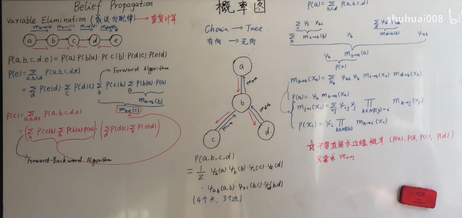
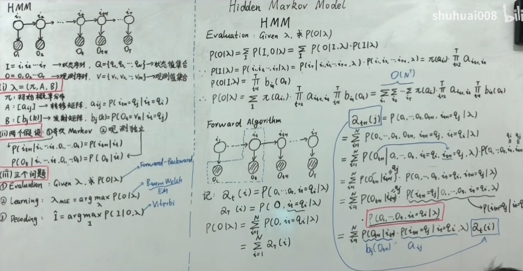

  ## 指数族分布

### 指数族分布的形式

$$
P(x|\eta)=h(x)exp(\eta^T\phi(x)-A(\eta))
$$

$\eta$为参数向量，$x\in R^p$，$A(\eta)$：log partition function配分函数，$\phi(x)$称为充分统计量，统计量就是样本的函数，充分统计量就是可以完整表达出样本信息的统计量，例如高斯分布，样本均值和方差就可以作为充分统计量。在指数族分布中，存在大量的样本数据的情况下可以只保留充分统计量。

同时，指数族分布满足共轭特性，即似然具有一个与它共轭的先验，则先验和后验具有相同的分布形式

共轭的例子：如假设似然是二项式分布，如果先验是Beta分布，则后验也是Beta分布
$$
P(x|\eta)=\frac{1}{exp(A(\eta))}h(x)exp(\eta^T\phi(x))=\frac1Z \hat{P}(x|\eta)
$$
这里由于$Z$称为配分函数，$A(\eta)=logZ$，因此称为Log配分函数

### 高斯分布的指数族形式

$$
\begin{aligned}
P(x|\theta)&=\frac{1}{\sqrt{2\pi}\sigma}exp\{-\frac{(x-\mu)^2}{2\sigma^2}\}\\
&=explog(2\pi\sigma^2)^{-\frac12}exp\{-\frac{x^2}{2\sigma^2}+\frac{\mu x}{\sigma^2}-\frac{\mu ^2}{2\sigma^2}\}\\
&=exp\{(\frac{\mu }{\sigma^2}\;\;-\frac{1}{2\sigma^2})(x\;\;x^2)^T-\frac{\mu ^2}{2\sigma^2}-\frac12log2\pi\sigma^2\}\\
\end{aligned}
$$

令
$$
\eta=(\eta_1\;\;\eta_2)^T=(\frac{\mu }{\sigma^2}\;\;-\frac{1}{2\sigma^2})^T\\
A(\eta)=-\frac{\eta_1^2}{4\eta_2}+\frac12log(-\frac{\pi}{\eta_2})
$$

$$
P(x|\theta)=exp\{\eta^T\phi(x)-A(\eta)\}
$$

### 对数配分函数与充分统计量

$$
P(x|\eta)=\frac{1}{exp(A(\eta))}h(x)exp(\eta^T\phi(x))
$$

由于$P$是概率密度函数，必须满足积分为1，因此
$$
exp(A(\eta))=\int h(x)exp(\eta^T\phi(x))dx
$$
两边都对$\eta$求导
$$
exp(A(\eta))A'(\eta)=\int h(x)exp(\eta^T\phi(x))\phi(x)dx
$$

$$
\begin{aligned}
A'(\eta)&=\frac{\int h(x)exp(\eta^T\phi(x))\phi(x)dx}{exp(A(\eta))}\\
&={\int h(x)exp(\eta^T\phi(x)-A(\eta))\phi(x)dx}\\
&=\int P(x|\eta)\phi(x)dx\\
&=\mathbb E_{P(x|\eta)}[\phi(x)]
\end{aligned}
$$

$$
A''(\eta)=Var[\phi(x)]
$$

则$A(\eta)$是凸函数

### 极大似然估计与充分统计量

数据$D={x_1...x_N}$
$$
\begin{aligned}
\eta_{MLE}&=argmax\;\;log\prod P(x_i|\eta)\\&=argmax\;\;\sum logh(x_i)exp(\eta^T\phi(x_i)-A(\eta))\\
&=argmax\;\;\sum [logh(x_i)+\eta^T\phi(x_i)-A(\eta)]\\
&=argmax\;\;\sum [\eta^T\phi(x_i)-A(\eta)]
\end{aligned}
$$

$$
\begin{aligned}
\nabla_{\eta}\sum [\eta^T\phi(x_i)-A(\eta)]&=\sum [\nabla_{\eta}\eta^T\phi(x_i)-\nabla_{\eta}A(\eta)]\\
&=\sum \phi(x_i)-NA'(\eta)\\
\end{aligned}
$$

$$
A'(\eta_{MLE})=\frac1N\sum \phi(x_i)
$$

而函数$A(\eta)$的形式是知道的，那么可以求导数的反函数得到最优的$\eta$，*实际上这也表明了充分统计量的意义，不需要记录全部的数据，而是只要计算出充分统计量，就可以把模型的参数计算出来*

### 最大熵角度看指数族分布

在满足已知事实(N个样本)，变为约束后，

引入*经验概率分布*，是对样本的描述
$$
\hat{P}(X=x)=\hat{P}(x)=\frac{count(x)}{N}
$$
假设$f(x)$是任意关于$x$的函数，则$E_{\hat{p}}[f(x)]=\Delta$为数字特征，是已知量，同时是对数据和分布的表达，作为已知事实。则在满足已知事实的情况下，熵最大的分布变为一个优化问题，为了简化分析，这里采用离散分布，数字特征包含$Q$个特征函数，$f(x)=(f_1(x)\;\;f_2(x)...f_Q(x))^T$

$$
\begin{aligned}
argmin &\;\;\sum_{x} P(x)logP(x)\\
s.t.\;\;&\sum_{x}P(x)=1\\
& E_{p}[f(x)]=E_{\hat{p}}[f(x)]=\Delta
\end{aligned}
$$

$$
L=\sum_{x} P(x)logP(x)+\lambda_0(1-\sum_{x}P(x))+\lambda^T(\Delta-E_{p}[f(x)])
$$

$$
\begin{aligned}
\nabla_{P(x)}L=\sum_{x}(1+logP(x))-\sum_{x}\lambda_0-\sum_{x}\lambda^Tf(x)=0\\
\end{aligned}
$$

$$
\sum_{x}(1+logP(x)-\lambda_0-\lambda^Tf(x))=0
$$

$$
P(x)=exp(\lambda^Tf(x)-(1-\lambda_0))
$$

## 概率图模型

Representation表示

* 有向图
* 高斯图 连续
* 无向图

Inference推断

* 精确推断
* 近似推断
  * 确定性近似(变分推断)
  * 随机近似(MCMC)

Learning学习

* 参数学习
  * 完备数据
  * 隐变量
* 结构学习

### 贝叶斯网络

对于复杂的概率模型，希望通过条件独立性的假设来简化模型，并且如果模型本身具有条件独立性，实际上可以通过有向图很好地表达出来，独立性在图中都可以进行表示

#### D-Seperation

在图做出来后，需要判断路径是否阻塞

* head to tail型，当中间变量b在观测集合中时，两侧变量独立，则经过b的信息传递路径被堵塞
* tail to tail 当b被观测时，ac独立，信息无法经过bc传输
* head to haed，与上面相反，当b被观测时，ac不独立，路径连通，而它的子孙节点在被观测时，会反向传递，仍然使得ac不独立

**D-Seperation定义:** 当路径p被结点集Z，d-分离（或被blocked掉）时，当且仅当以下条件成立： 1. 若p包含形式如下的链i->m->j 或i<-m->j，则结点m在集合Z中。 2. 若p中包含collider（碰撞点）i->m<-j,则结点m不在Z中且m的子代也不在Z中。

更进一步说，如果Z将X和Y d-separate，当且仅当Z将X，Y之间的每一条路径都block掉。

对于满条件概率，如果利用贝叶斯网络作为模型，则条件概率之和它临近的父节点、子节点以及子节点的另一半父节点相关。

### 常见的贝叶斯网络模型

混合模型和时间结合，就是动态模型，LDS线性状态系统，常见的为卡尔曼滤波，连续线性，是线性高斯系统的例子。粒子滤波Partical Filter，非高斯，非线性

### Markov随机场-无向图模型

无向图的条件独立性体现在：全局、局部、成对三个方面

无向图的因子分解更加麻烦，因此需要先定义团和最大团的概念，然后通过最大团进行因子分解。

**核心是Hammesley-clifford**定理，这个要看一下

### Inference

#### Variable Elination

**是精确推断的中心思想，是乘法对加法的分配率**

在已知联合概率求边缘概率时，利用模型条件独立性，可以把求和或者积分号与连乘换位置，简化运算，但是如何找到这样一个消除次序对计算复杂度影响很大的，而且要找到一个最优的消除次序已被证明是一种NP-hard问题

#### Belif Propagation

重复计算体现在：在计算P(b)、P(c)等时，都要完整走一遍变量消除的流程，存在大量重复的计算。BP的思想是直接把正向和反向的计算都先求出来，则只需要按照要求给出这些值相应的组合，避免的重复运算。

BP算法最适合树结构 

可以理解为信息量的传递，b作为中间路径，保留子节点的信息，传递给父节点，以此计算父节点的概率。BP算法就是通过遍历图，算出所有的$m_{ij}$

首先选中一个点作为$root$，然后收集消息，即所有节点向$root$走的路径上的$m_{ij}$，最后分发消息，即从$root$向外走的路径上的所有$m_{ij}$，这样就完成了图的遍历。

BP算法一种是序列形式，Sequential Implementation，另一种是Parelle Implementation，主要是在并行系统上加速运算，并行地互相传递信息，不断更新，最终可以达到收敛

#### Max Product

把图的节点分为两种，X和E，E是Evidence，可以认为是已知的观测概率，边缘概率是求似然，条件概率是求后验，都可以对部分变量求。MP算法可以从求最大后验概率中引出，希望找到一条最大概率路径，实际上是BP算法和维特比算法的组合推广，同样需要记录路径。

### 概念补充-道德图 Moral Graph

产生原因：想把有向图转为无向图，因为无向图更加Generalize

其中一个重要的结论是，在转化成的无向图中的一个Seperation等价于在原始有向图中的一个D-seperation 

但是树型有向图转成有向图时可能会引入环，即碰撞点这类结构，普通的BP算法无法应用于环结构

### 概念补充-因子图 Factor Graph

因子图出发点：

* 解决道德图中引入环的问题
* 简化运算

由于有向图都可以化为无向图，因此对于无向图来说，做因式分解本身就对应着一种特殊的因子图

## MCMC

### 采样方法介绍

一、概率分布采样

在已知概率密度函数PDF的情况下，通过积分求出CDF(The Cumulative Distribution Function 累计分布函数 )，由于计算机很容易采样一个[0,1]均匀分布，因此将采样得到的值与CDF的值对应，求出此时的x，即为一次采样的值

？？？这里为什么还没证明

二、拒绝采样

三、重要性采样

实际上是在计算期望过程中的方法

依赖于p(z)和q(z)的相似程度，如果二者分布比较相反，即在p大的地方，q小，样本点少，通过p/q来修正扩大采样值，但这样仍然难以保证p大的地方有足够多的样本，反而采样噪声变大。

重要性采样的一种改进方式，即sampling-importance-resampling，图例如右上角，它是两个阶段的采样，先由重要性采样得到样本值，同时还可以计算出相应的weight，第二阶段将采样出来的样本按照weight再进行采样，这样可以保证P大的地方可以有足够多的样本点

### 马尔可夫链

 

### MeTropolis-Hasting

求后验概率很多时候都是为了计算某个函数对于这个后验概率的期望，因此如果有足够充分的z的样本点的话，期望就可以用均值来代替。

核心就是希望构造一个马尔可夫链，在收敛后它的平稳分布就是要采样的分布

### Gibbs

它是一个特殊的MH采样方式。假设要采样的分布的维度特别高，则它每次按满条件概率进行采样。

那么只需要考虑MH采样中的接受率在吉布斯采样中被表示为了什么。

这里要注意，无论$z_i$取什么值，它的满条件$z_{-i}$是固定的，因此
$$
P(z_{-i}^*)=P(z_{-i})\\
P(\;\;\;|z_{-i}^*)=P(\;\;\;|z_{-i})\\
$$

### Riview

采样的动机是什么？

1、采样本身就是常见的任务  2、求和或者求积分

什么样的样本算好样本？

1、样本趋向于高概率区域  2、样本之间最好是相互独立的

采样本身实际上是困难的(维度诅咒，the curse of high dimensionality)，比如之前无向图模型，它的归一化系数$Z$是需要积分得到，一旦$X$的维度特别高，这个积分基本没办法计算，即partation function is intractable，因此无法直接采样，*而比如MH算法，通过相除正好消掉了这个常数$Z$*

### 平稳分布

如果从矩阵的角度来看转移概率的极限行为，根据随机过程书P204，**随机矩阵一定包含一个为1的特征值，且它是最大的特征值，如果仅存在一个为1的特征值，那么转移概率矩阵的极限就会收敛到某个秩为1的矩阵，这是由非周期不可约的转移矩阵P一定是本原矩阵，再加上本原矩阵的性质得到的，并且满足**
$$
\lim_{n\rightarrow\infty}P^n=b_1c_1^T
$$
其中
$$
b_1=(1,1,...,1)^T
$$
因此易得如果转移概率存在极限的话，它一定是只与终状态有关，即
$$
\lim_{n\rightarrow\infty}P_{ij}^{(n)}=\pi_j>0
$$

### 采样思路以及面临的困难

一、理论只保证收敛性，但无法知道何时收敛，燃烧期的时间未知，一般只能通过定义一些统计量，一段时间计算一下比较。

二、有可能这个燃烧期过长，无法到达收敛状态，根本原因还是因为$P(x)$太复杂，维度太高，并且不同维度的相关性很强。

三、连续采样的话样本之间有一定的相关性，因此一般是隔几百步取一个样本

四、难以处理多维的问题

## HMM隐马尔科夫模型

### 前向算法

直接算$P(O|\lambda)$的计算量是$O(N^T)$,计算量是指数级增加的。

### 后向算法

  

### Baum Welch算法(EM)

只需要按照EM算法的步骤一点一点带入计算就行

### Decoding 问题-Viterbi算法

### Filtering Smoothing Prediction

## 线性动态系统

概率图+时间就是动态模型，又称状态空间模型，可以分为三类

* HMM：要求隐变量必须是离散的
* Linear Dynamic System（Kalman Filter）Linear Gaussian Model:隐变量和状态都可能是连续的
* Partical Filter:Non-Linear,Non-Gaussian

卡尔曼滤波分两步:1、预测  2、更新修正

由于高斯分布的优良特性，条件概率、联合概率等都可以带入，使得求解迭代形式更加地显示

## 粒子滤波

Kalman Filter是可以求出解析解的，而粒子滤波这种非线性系统，通常只能通过采样的方式解决问题。

Sequential Important Sampling，实际上为了简化重要性采样在滤波问题中的运算，希望得到权重的迭代关系。因为这里求$f$对于后验$P(X|Z)$的期望，转化为采用蒙特卡罗法，利用Importance Sampling的想法，但问题在于滤波问题是一个不断迭代的过程，如果每次都重新计算重要性系数$W_{t}^{i}=p(z^{(i)})/q(z^{(i)})$，计算量很大，因此如果能找到$W_{t}^{i}$与$W_{t}^{i-1}$的迭代关系就好了。

SIS(Sequential Importance Samlping)

它在解决上述问题时，不是直接求$p(z_t|x_{1:t})$，而是先求$p(z_{1:t}|x_{1:t})$的迭代关系

SIS可能遇到权值退化的问题，因此引入重采样。也就是原来采样的样本每一个都有一个权重，然后再按权重重新进行采样，使得每个样本的权重变成1，实际上就是权重越大的样本复制得更多。

SIS+Resampling 就是一个基本的粒子滤波算法

