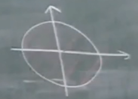

## 基本概率部分复习

斯坦福的实验团队曾做过一个抛硬币实验，通过严格的数学方程，边界条件限制，做了一个抛硬币机，可以决定硬币落地的正反。而最后的结果是，大部分硬币落地和预期是一样的，但仍有部分硬币落在了另一面，他们认为这是由于chaos即混沌影响的，这个动力系统是初值敏感的，在实验中会影响实验结果。这类做实验后不止一个结果的，统称为统计实验Statistical Experiment，这里我们选择接纳不确定性。把所有可能的实验结果放在一起，构成了样本空间$\Omega$Sampling Space，这是一个确定的集合，没有一点不确定性。在样本空间$\Omega$上，可以定义概率$P(A)$，实际上概率是一个以集合作为自变量的函数，它是样本空间子集的函数，把它归一化到$[0,1]$，因此我们想表达的是这个实验中出现的样本点A它的可能性大小，是先验给定的，是人们在反复实验的经验中得到的结果，本身也不包含任何不确定性，比如高斯分布、泊松分布、伯努利分布，在生活中的很多角落都有它的应用。

> 概率空间$(\Omega,\sum,P)$包含样本空间$\Omega$，样本空间中子集组成的集合$\sum$，概率$P$，这三者是预先给定的，来自经验。

### 随机变量

*随机变量*是从样本空间中引出的概念，是一个从样本空间到实数轴的确定性*函数*，$X:\Omega\rightarrow\mathbb R$ ，它起了一个量化的作用。因为样本空间只是统计实验的结果，它们未必被数量化了，则无法应用相应的数工具。

我们从来不懂得如何做不确定的计算，只懂得做确定的计算，概率的计算没有不确定。

注意，概率和统计是两门完全不同的科学。所有的数据都是上帝给的，所有的模型都是人造的。对于概率而言，是要先有模型，人造的，是研究概率的基础，概率是通过对这些模型的应用去得到各种各样的决策，在我得到决策的过程中，模型是先验给出的前提条件。而模型的怎么来的，是统计来的，因此统计是要以数据为基础，通过一系列的数据使用，得到模型。如果从数据直接到决策，就是大数据，此时由于数据量太大，难以剖析出数据的内在结构，就算能建立出模型也太复杂了，因此选择妥协了，直接由数据得到结论

### 随机过程

随机过程是以t标记的一组随机变量$X(t)=X(t,\omega)$，又称随机函数，因为给定一个自变量，它得到的是一个随机变量。它是定义在样本空间和实数的笛卡尔积上，映射到实数轴上的，即$\Omega\times\mathbb R\rightarrow\mathbb R$

## 随机过程概论1

Stochastic Process：早期研究和Gamble相关 $\leftrightarrow$ Group of Random Variables (Care Relationship):

1. Correlation(Linear) 典型为高斯过程Gaussian Process
   1. Time Domain $\rightarrow$ Correlation Function
   2. Frequency Domain $\rightarrow$ Spectrum
2. Markov Property 未来的情况只取决于当前的状态，典型为泊松过程Poisson Process
   1. Discrete Time
   2. Continuous Time
3. Martingale 鞅 可能讨论Optional Theorem $\rightarrow$ Financial Application

假定$X$和$Y$都是随机变量，随机变量的联合概率密度可以表示为

$$
f_{X,Y}(x,y)=\frac{\partial^2}{\partial x \partial y}F_{X,Y}(x,y)
$$

$$
F_{X,Y}(x,y)=P(X\le x, Y\le y)
$$

考虑上图这样的概率密度分布:
$$
f_{X,Y}(x,y)=
\begin{cases}

1, & |x|\le1,|y|\le1 \\
0,& others \\

\end{cases}
\\
f_{X,Y}(x,y)=f_X(x)f_Y(y)
$$
这种情况下两个随机变量是独立的，即$X$的分布并没有改变$Y$的分布情况

考虑上图这样的概率分布：
$$
f_{X,Y}(x,y)=
\begin{cases}

\frac{1}{\pi}, & x^2+y^2\le1 \\
0,& others \\

\end{cases}
\\
f_{X,Y}(x,y)\ne f_X(x)f_Y(y)
$$
这两者已经是相关的，即correlated，即$X$的改变会改变$Y$的分布情况

考虑上图这样的概率分布
$$
f_{X,Y}(x,y)=
\begin{cases}

\frac{1}{\Omega}, & (x,y)\le D \\
0,& others \\

\end{cases}
\\
f_{X,Y}(x,y)\ne f_X(x)f_Y(y)
$$
这里随机变量$X$与$Y$之间已经产生出了线性关联Linear Correlation，可以用**相关系数**描述这个纺锤体的胖瘦，**相关系数**越大，纺锤越瘦，说明它的线性度越高。

研究线性关联的两个随机变量，希望可以表示为$Y=\alpha X \Longrightarrow E(Y-\alpha X)^2$，这里考虑纺锤体的面积，采用Mean Square Error来表现关联度，这里的$\alpha$反映的是图中直线的斜率，这条正好由纺锤体中穿过的直线的等效为$\min_{\alpha} E(Y-\alpha X)^2 \Longrightarrow \alpha_{opt}=\frac{E(XY)}{E(X^2)}$，这门课更关注$E(XY)$，即Correlation 

这里考虑之间常见的一种中心化后的相关的定义：
$$
\begin{aligned}
E(X-EX)(Y-EY)&=E(XY)-E(XEY)-E(YEX)+EXEY\\
&=E(XY)-EXEY-EXEY+EXEY\\
&=E(XY)-EXEY
\end{aligned}
$$
两种相关只差了一个常数$EXEY$,它与随机变量的关联没有关系，因此这里不再区分计算相关是否要减去均值

Uncorrelated:$E(XY)=0$(通常假定$EXEY=0$)

**注意，这里Independence比Uncorrelated更强**，举例来说，$\theta\sim U(0,2\pi),X=\cos\theta,Y=\sin\theta$，由于满足$X^2+Y^2=1$，二者不独立。$E(X)=\int_{-\infty}^{+\infty}\sin\theta f_\theta(\theta)d\theta=\int_{0}^{2\pi}\sin\theta \frac{1}{2\pi}d\theta=0$，同理$E(Y)=0$，

$E(XY)=\int_{0}^{2\pi}\sin\theta\cos\theta \frac{1}{2\pi}d\theta=0$，因此，$E(XY)-EXEY$，二者不相关。

相关从某种意义上描述了两个随机变量之间的关联，但是这种描述是比较局限的，且只是一个二元关联。这里想要从集合上得到相关的GeoMetric View $E(XY)=<X,Y>$，即Inner Product内积。

内积是在线性空间上的一个二维操作，$<X,Y>:H\times H\rightarrow\mathbb R$，满足三条性质:
$$
\begin{aligned}
&<X,Y>=<Y,X>\\
&<X,X>\ge0,<X,X>=0\Leftrightarrow X=0\\
Bilinear:&<X,\alpha Y+\beta Z>=\alpha<X,Y>+\beta<X,Z>\\
&<\alpha X+\beta Y,Z>=\alpha<X,Z>+\beta<Y,Z>
\end{aligned}
$$
可以看出，由于期望本身是满足线性关系的，所以这里$E(XY)$也满足上述性质，唯一需要注意的是，$E|X|^2=0$不能保证$X=0$，即在概率论的世界中，概率为零的事件不代表它不可能发生，比如一个01区间上取一个点，取到有理数的概率为0，但是可以保证$P(X=0)=1$，我们认为这件事就是确定性事件。*注意这里只是认为，概率为0和确定性事件仍然是两码事*

内积对应的是角度，$\cos\angle(x,y)=\frac{<x,y>}{(<x,x>,<y,y>)^{\frac 12}}$，**因此可以把随机变量看成矢量**，这里很像随机变量的相关系数。但是为了满足余弦函数的取值范围，右侧的公式需要限制在$[-1,1]$，这一点可以由Cauchy–Schwarz inequality来保证，即$|<x,y>|\le(<x,x><y,y>)^{\frac{1}{2}}$

> 证明：构造一个辅助函数满足$0\le g(\lambda)=<\lambda x+y,\lambda x+y>=\lambda^2<x,x>+2\lambda<x,y>+<y,y>$，它是一个对于$\lambda$而言的一元二次式，开口向上，因此它的解只有重根或者无解的情况，判别式$\Delta\le0$

因此对于两个随机变量，$\cos\angle(X,Y)=\frac{E(XY)}{(EX^2 EY^2)^{\frac 12}}$

我们希望找到它们的*几何关系*，同样这里仍然将两个变量进行线性表示$Y=\alpha X$，从几何的角度，$\alpha$的求解是将$Y$投射在$X$上，即这个投影可以表示为
$$
||Y||\cos\theta\frac{X}{||X||}=(\frac{||Y||}{||X||}\cos\theta)X=(\frac{||Y||}{||X||}\frac{E(XY)}{||X||||Y||})X=\frac{E(XY)}{E(X^2)}X=\alpha_{opt} X
$$
这与上面在代数优化过程中求$\min_{\alpha} E(Y-\alpha X)^2$获得的结果是一样的

#### Correlation Function

首先引入随机过程$X(t)$，过程的意思是有一个index$t$，不一定就是指时间，随机是值随机变量，因此随机过程代表一类或者一组随机变量，每一个index都可以得到一个随机变量。如果这个index$t$是二维的，就变成随机场Random Field。在这个基础上可以定义相关函数Correlation Function，也称自相关函数，是二元的
$$
R_X(t,s)=E(X(t)X(s))
$$
它反映的是随机过程在两个不同时间点上取值得到的两个不同随机变量之间的相关性，它有如下特点
$$
R_X(t,s)=R_X(s,t)\\
|R_X(t,s)|\le(|R_X(t,t)||R_X(s,s)|)^{\frac{1}{2}}
$$
我们希望把相关函数变成一个单变量函数univariate，这里引入一个重要概念：平稳

> 平稳性Stationary：
>
> 宽平稳Wide-Sence:它涉及到两个随时间发展变化而保持不变的特性，满足
>
> * $1、E(X(t))=m(t)\equiv m$
> * $2、R_X(t,s)=R_X(t+D,s+D),\forall D\in\mathbb R$
>
> 在宽平稳过程中的上述两条特性，第一条其实不重要，因为如果均值不是恒定值，只需令$X(t)=X(t)-m(t)$即可，即*对于随机过程，确定性事件例如均值等的影响都是不重要的*
>
> 对于第二点，可以推得自相关函数在这里只与两个时刻之间的距离相关，即$R_X(t,s)=R_X(t-s)=R_X(\tau)$，其中$\tau=t-s$，至此，相关函数由二元变为一元

Example1:Modulated signal  $X(t)=A(t)\cos(2\pi f_0t+\theta),\:A(t)\: r.v,\:\theta\sim U(0,2\pi).$ 两个变量间是独立的
$$
\begin{aligned}
E(X(t))&=E(A(t))E(\cos(2\pi f_0t+\theta))\\
&=E(A(t))\frac{1}{2\pi}\int_0^{2\pi}cos(2\pi f_0t+\theta)d\theta\\
&=0
\end{aligned}
$$

$$
\begin{aligned}
R_X(t,s)&=E(X(t)X(s))\\
&=E(A(t)A(s))E(\cos(2\pi f_0t+\theta)\cos(2\pi f_0s+\theta))\\
&=E(A(t)A(s))\frac12\{E(\cos(2\pi f_0 (t+s)+2\theta))+E(\cos(2\pi f_0 (t-s)))\}\\
&=E(A(t)A(s))\frac12\cos(2\pi f_0 (t-s))\\
&=\frac12R_A(t-s)\cos(2\pi f_0 (t-s))\quad条件是如果A也是宽平稳的
\end{aligned}
$$

则对于上述振幅调制加相位噪声，如果振幅调制$A$本身是宽平稳的，则上述过程是宽平稳的

Example2:Random Telegram Signal  

对于上述信号，在任意一个时段之内，在-1和1的切换是有随机性的，在一个长度为$t-s$的时段$[s,t]$内，切变$k$次的概率为：(这是Poisson Distribution)
$$
P=\frac{(\lambda(t-s))^k}{k!}e^{-\lambda(t-s)}
$$

$$
\begin{aligned}
R_X(t,s)&=E(X(t)X(s))\\
&=1\cdot P_1+(-1)\cdot P_{-1}
\end{aligned}
$$

乘积为1意味着两个时刻它是同号的，则在两个时刻之间翻转了偶数次$P_1=P([s,t].even)$，反之，乘积为-1意味着反转了基数次$P_{-1}=P([s,t].odd)$，不过这里偶数算出来，基数用1减去它就好。为了计算$P_1$，我们观察式(13)的性质，实际上也可以理解为是指数函数泰勒展开的性质
$$
\sum_{k=0}^{\infty} \frac{(\lambda(t-s))^k}{k!}=e^{\lambda(t-s)}
$$
对于上式，如果在底数项内加上负号，则左侧所有偶数项为正，奇数项为负
$$
\sum_{k=0}^{\infty} \frac{(-\lambda(t-s))^k}{k!}=e^{-\lambda(t-s)}
$$
则二者相加，可以推得
$$
P_1=P([s,t].even)=\frac{1}{2}(e^{\lambda(t-s)}+e^{-\lambda(t-s)})e^{-\lambda(t-s)}=\frac{1}{2}(1+e^{-2\lambda(t-s)})
$$

$$
P_{-1}=P([s,t].even)=\frac{1}{2}(1-e^{-2\lambda(t-s)})
$$

所以可以得到随机电报信号的相关函数为
$$
\begin{aligned}
R_X(t,s)&=1\cdot P_1+(-1)\cdot P_{-1}\\
&=e^{-2\lambda(t-s)}
\end{aligned}
$$
因此上述过程是宽平稳的

## 宽平稳过程

### 相关函数的性质

之前已经得到相关函数必须满足的性质，即
$$
R_X(t,s)=R_X(s,t)\\
|R_X(t,s)|\le(|R_X(t,t)||R_X(s,s)|)^{\frac{1}{2}}
$$
对于宽平稳过程，上述性质变为
$$
R_X(t,s)=R_X(s,t)=R_X(t-s)=R_X(\tau)=R_X(-\tau)\\
|R_X(\tau)|\le R_X(0)
$$
两个信号对齐过程中，什么时候相关值最大？可以想象肯定是完全对齐的时候，因此有$R_X(0)$为最大值。在电子工程领域，对于这种一旦信号对不齐时，相关值骤减的信号成为强相关信号，比如扩频手机就是采用相关接收，实现码分多址。

除了上述两种性质，宽平稳过程的相关函数还有一个重要的性质，即**正定性-Positive Definite**

> 称一个函数$f(x)$是正定的P.D，当满足$\forall n,\forall x_1,x_2,\cdots,x_n.$  $(f(x_i-x_j))_{ij}\ge0$ 这里表示矩阵正定

这里，采用一个常用的矩阵正定的定义，工程上不区分严格正定，即是否取到等于号

> $\mathbf A\in\mathbb R^{n\times n}\ge0\Longleftrightarrow \forall \alpha\in\mathbb R^n,\alpha^T\mathbf A\alpha\ge0$

我们从正定性出发，对于宽平稳随机过程:

$R_X(\tau)$ is P.D $\Longrightarrow R_X(0)\ge 0$ 证明：取$n=1.\forall x_1,(R_X(x_1-x_1))\ge0$

$R_X(\tau)$ is P.D $\Longrightarrow R_X(0)\ge |R_X(\tau)|.\forall \tau$ 证明：$n=2,x_1=0,x_2=\tau$，可以得到矩阵

$$
\begin{pmatrix}

R_X(0) & R_X(-\tau) \\
R_X(\tau) & R_X(0) \\

\end{pmatrix}
$$
由于该矩阵正定，则它一定对称，$R_X(\tau)=R_X(-\tau)$，且由行列式需要为正，自然得到上述柯西不等式。

为了验证相关函数$R_X(\tau)$是否真的是正定的，即验证$\forall n,\forall \tau_1,\tau_2,\cdots,\tau_n.$  $(R_X(\tau _i-\tau _j))_{ij}\ge0$。因此在这里我们取$\forall \alpha \in \mathbb R^n,\alpha=(\alpha_1,\cdots,\alpha_n)^T$，则
$$
\alpha^T \mathbf R\alpha=\sum_{i=1}^n\sum_{j=1}^n R_X(\tau_i-\tau_j)\alpha_i\alpha_j
$$
根据相关函数的定义，式(23)可写为(注意这里$\alpha$没有随机性)
$$
\begin{aligned}
\alpha^T \mathbf R\alpha&=\sum_{i=1}^n\sum_{j=1}^n E(X(\tau_i)X(\tau_j))\alpha_i\alpha_j\\
&=E(\sum_{i=1}^n\sum_{j=1}^n X(\tau_i)X(\tau_j)\alpha_i\alpha_j)\\
&=E(\sum_{i=1}^n X(\tau_i)\alpha_i)^2\ge0证毕
\end{aligned}
$$
将随机过程表示为$X=(X(\tau_1),\cdots,X(\tau_n))^T$，则上述判定矩阵可以表示为$(R_X(\tau_i-\tau_j))_{ij}=E(XX^T)=\mathbf R$，称为相关矩阵Correlation Matrix

> 相关矩阵$R$都是正定的
>
> 证明：$\alpha \mathbf R\alpha^T=\alpha^TE(XX^T)\alpha=E(\alpha^T XX^T\alpha)=E(\alpha^T X)^2$

**由此，得到相关函数的正定性，可以说，任何正定的函数都是相关函数，并且一定能找到它对应的某一个随机过程**

#### 相关函数两个更特殊的性质

###### 性质一

*由柯西不等式知，$R_X(0)\ge|R_X(\tau)|,\forall \tau$，考虑如果满足取等号即$R_X(0)=R_X(T)$，则一定可以推断出这个相关函数后面必然开始震荡，且震荡满足$R_X(\tau)=R_X(\tau+T)$*

证明：直接证明不好证，这里加一步跳板，$step1:R_X(0)=R_X(T)\Longrightarrow E|X(\tau+T)-X(\tau)|^2=0$，$step2:E|X(\tau+T)-X(\tau)|^2=0\Longrightarrow R_X(\tau)=R_X(\tau+T)$

step1:$E|X(\tau+T)-X(\tau)|^2=0$称为均方周期性，是一种整体性质
$$
\begin{aligned}
E|X(\tau+T)-X(\tau)|^2&=EX(\tau+T)^2+EX(\tau)^2-2E(X(\tau+T)X(\tau))\\
&=R_X(0)+R_X(0)-2R_X(T)\\
&=2R_X(0)-2R_X(T)\\
&=0
\end{aligned}
$$
注意，这里能用局部性质推出整体性质，是一件值得思考的事情。

step2:
$$
\begin{aligned}
|R_X(\tau+T)-R_X(\tau)|&=|E(X(0)X(\tau+T))-E(X(0)X(\tau))|\\
&=|E(X(0)(X(\tau+T)-X(\tau)))|\\
&看成两项的求相关，由柯西不等式\\
&\le (E(X(0)^2)E|X(\tau+T)-X(\tau)|^2)^\frac12=0
\end{aligned}
$$

##### 性质二

问题引出：是否存在形如矩形窗的相关函数？

*如果相关函数在零点连续，则它在任意点均连续。*这是另一个典型局部推出整体的性质。

证明：跳板选取为均方连续，$step1:R_X(\tau)\;is\;continuous\;at\;0\Longrightarrow E|X(\tau+\Delta)-X(\tau)|^2\rightarrow0(\Delta\rightarrow0)$，$step2:E|X(\tau+\Delta)-X(\tau)|^2\rightarrow0(\Delta\rightarrow0)\Longrightarrow R_X(\tau)\;is\;continuous\;at\;\tau\;\forall \tau$

Step1:在随机过程中，认为两个随机变量间的距离为均方距离，$d(X,Y)=(E(X-Y)^2)^{\frac12}$，则可以得到随机意义上的极限定义：

> $X_n\xrightarrow{n\rightarrow\infty}X$ 定义为 $\forall \epsilon>0.\exist N>0.s,t.n>N.(E(X_n-X)^2)^{\frac12}\le\epsilon$
>

上述均方距离是否满足距离的定义？

1. 非负 满足
2. 三角不等式，这里采用两边之差小于第三边来验证，即验证$|(EX_1^2)^{\frac12}-(EX_2^2)^{\frac12}|\le|E(X_1-X_2)^2|^{\frac12}$，化简易知等于证明$E(X_1 X_2)\le (E(X_1)E(X_2))^{\frac12}$，即柯西不等式

step1:
$$
\begin{aligned}
E|X(\tau+\Delta)-X(\tau)|^2&=-2R_X(\Delta)+EX(\tau+\Delta)^2+EX(\tau)^2\\
&=2R_X(0)-2R_X(\Delta)\\
&\rightarrow0,(\Delta\rightarrow0)这里利用的是连续R_X(\tau)在零点连续
\end{aligned}
$$
step2:这里证明需要证明的是$|R_X(\tau+\Delta)-R_X(\tau)|\rightarrow0. \;if \;\Delta\rightarrow0$
$$
\begin{aligned}
|R_X(\tau+\Delta)-R_X(\tau)|&=|E(X(0)X(\tau+\Delta))-E(X(0)X(\tau))|\\
&=|E(X(0)(X(\tau+\Delta)-X(\tau))|\\
&\le [EX(0)^2E|X(\tau+\Delta)-X(\tau)|^2]^{\frac12}\\
&\rightarrow0,(\Delta\rightarrow0)
\end{aligned}
$$
Bochner提出了一个函数正定性的判定：$f(x) \;is\;P.D\Longleftrightarrow\int_{-\infty}^{+\infty}f(x)e^{-j\omega x}dx\ge0$，*把正定表示成了在频域上为正值*

由于矩形窗函数的傅里叶变换存在负部分，因此不是正定。

(1)、如傅里叶变换是正的，则原函数正定

$F(\omega)=\int_{-\infty}^{+\infty}f(x)e^{-j\omega x}dx\Longrightarrow f(x)=\frac{1}{2\pi}\int_{-\infty}^{+\infty}F(\omega)e^{j\omega x}d\omega$，已知$F(\omega)\ge 0$

这里首先证明$g(x)=e^{j\omega x}$是正定的，采用定义，$\forall n.\forall x_1,x_2,\cdots,x_n$，$(exp(j\omega(x_i-x_j)))_{ij}=B$，证明$\forall\alpha\in\mathbb {C}^n,\alpha^HB\alpha\ge0$

$\alpha^HB\alpha=\sum_{i=1}^n\sum_{j=1}^n R_X(\tau_i-\tau_j)\alpha_i\alpha_j$
$$
\begin{aligned}
\alpha^HB\alpha&=\sum_{i=1}^n\sum_{j=1}^n (exp(j\omega(x_i-x_j)))_{ij}\bar{\alpha_i}\alpha_j\\
&=(\sum_{i=1}^n exp(j\omega x_i)\bar{\alpha_i})^2\ge0\\
\end{aligned}
$$
由于$h(w,x)\enspace is\enspace P.d\Longrightarrow\sum_{k=1}^na_kh(\omega_k,x)\enspace is\enspace  P.d$，则可以推出原函数正定

## 谱分析

首先从确定性信号开始说起，考虑如何引入频谱分析：
对于确定的周期信号$x(t)$，满足$x(t+T)=x(t)$，则它的傅里叶级数可以写为
$$
x(t)=\sum_k\alpha_ke^{j\omega_kt}\\
\omega_k=\frac{2k\pi}{T}
$$
其中$\frac{2\pi}{T}$为基频。系数满足

$$
\alpha_k=\frac{1}{T}\int_{-\frac{T}{2}}^{\frac{T}{2}}x(t)e(-j\omega_kt)dt
$$

#### 对傅里叶展开的简单推导

傅里叶展开是将任意一个周期为$T$信号展开为基频以及基频倍频的三角信号，因此可以将展开后的信号写为：
$$
f(t)=a_0+\sum_{k=1}^{\infty}a_k\cos k\omega t+b_k\sin k\omega t
$$
其中$\omega=\frac{2\pi}{T}$为基频

两边同时积分，有
$$
\int_{-\frac{T}{2}}^{\frac{T}{2}}f(t)dt=\int_{-\frac{T}{2}}^{\frac{T}{2}}a_0dt\\
a_0=\frac{1}{T}\int_{-\frac{T}{2}}^{\frac{T}{2}}f(t)dt
$$
利用三角函数的正交性，先计算$a_k$，则$b_k$同理。两边同乘$\cos k\omega t$，并在一个周期内积分
$$
\begin{aligned}
\int_{-\frac{T}{2}}^{\frac{T}{2}}f(t)\cos k \omega t dt&=\int_{-\frac{T}{2}}^{\frac{T}{2}}a_k \cos^2k\omega t dt\;\;令u=k\omega t\\
&=a_k\frac{1}{k\omega}\int_{-k\pi}^{k\pi} \cos^2u du\\
&=a_k\frac{T}{2}
\end{aligned}
$$
因此，可以得到$a_k$为
$$
a_k=\frac{2}{T}\int_{-\frac{T}{2}}^{\frac{T}{2}}f(t)\cos k \omega t dt=\frac{2}{T}\int_{-\frac{T}{2}}^{\frac{T}{2}}f(t)\cos \omega_k t dt
$$
同理，可以得到$b_k$为
$$
b_k=\frac{2}{T}\int_{-\frac{T}{2}}^{\frac{T}{2}}f(t)\sin k \omega t dt=\frac{2}{T}\int_{-\frac{T}{2}}^{\frac{T}{2}}f(t)\sin \omega_k t dt
$$
为了获得更加简洁的表达，采用欧拉公式将它化成复指数形式

$$
\begin{aligned}
f(t)&=a_0+\sum_{k=1}^{\infty}a_k\cos \omega_k t+b_k\sin \omega_k t\\
&=a_0+\sum_{k=1}^{\infty}a_k\frac{exp(j\omega_kt)+exp(-j\omega_kt)}{2}+b_k\frac{exp(j\omega_kt)-exp(-j\omega_kt)}{2j}\\
&=a_0+\sum_{k=1}^{\infty}\frac{a_k-jb_k}{2}exp(j\omega_kt)+\frac{a_k+jb_k}{2}exp(-j\omega_kt)
\end{aligned}
$$
令
$$
c_k=\frac{a_k-jb_k}{2},c_{-k}=\frac{a_k+jb_k}{2}
$$
则可以得到
$$
f(t)=\sum_{k=-\infty}^{+\infty}c_kexp(j\omega_kt)
$$

$$
当k>0时,c_k=\frac{a_k-jb_k}{2}=(\frac{2}{T}\int_{-\frac{T}{2}}^{\frac{T}{2}}f(t)\cos \omega_k t dt-j\frac{2}{T}\int_{-\frac{T}{2}}^{\frac{T}{2}}f(t)\sin \omega_k t dt)/2=\frac{1}{T}\int_{-\frac{T}{2}}^{\frac{T}{2}}f(t)exp(-j\omega_kt)dt\\
当k=0时,c_k=\frac{1}{T}\int_{-\frac{T}{2}}^{\frac{T}{2}}f(t)dt\\
当k<0时,c_k=\frac{a_{-k}+jb_{-k}}{2}=(\frac{2}{T}\int_{-\frac{T}{2}}^{\frac{T}{2}}f(t)\cos \omega_k t dt+j\frac{2}{T}\int_{-\frac{T}{2}}^{\frac{T}{2}}f(t)\sin -\omega_k t dt)/2=\frac{1}{T}\int_{-\frac{T}{2}}^{\frac{T}{2}}f(t)exp(-j\omega_kt)dt\\
$$

综上，傅里叶变换的复指数形式可以同意写为：
$$
f(t)=\sum_{k=-\infty}^{+\infty}c_kexp(j\omega_kt)\\
c_k=\frac{1}{T}\int_{-\frac{T}{2}}^{\frac{T}{2}}f(t)exp(-j\omega_kt)dt
$$
对于非周期函数，当然可以做截断后进行周期延拓，以周期函数进行傅里叶展开，但是这样局限性太大，因此这里考虑把周期$T\rightarrow +\infty$，首先写出原函数的表达式
$$
\begin{aligned}
f(t)&=\sum_{k=-\infty}^{+\infty}\frac{1}{T}(\int_{-\frac{T}{2}}^{\frac{T}{2}}f(s)exp(-j\omega_ks)ds)exp(j\omega_kt)\\
&=\frac{1}{2\pi}\sum_{k=-\infty}^{+\infty}(\int_{-\frac{T}{2}}^{\frac{T}{2}}f(s)exp(-j\omega_ks)ds)exp(j\omega_kt)\omega\\
\end{aligned}
$$
由于当$T\rightarrow +\infty$时，$\omega=\frac{2\pi}{T}\rightarrow0$，上式可以看成一个积分形式
$$
f(t)=\frac{1}{2\pi}\int_{-\infty}^{+\infty}F(\omega)exp(j\omega t)d\omega
$$
同时，傅里叶变换为
$$
F(w)=\int_{-\infty}^{+\infty}f(t)exp(-j\omega t)dt
$$

### 随机信号的谱分析

希望借用确定性信号的分析方法，因此得到
$$
X(t)=\frac{1}{2\pi}\sum_{k=-\infty}^{+\infty}(\int_{-\frac{T}{2}}^{\frac{T}{2}}X(t)exp(-j\frac{2k\pi}{T} t)dt)exp(j\frac{2k\pi}{T} t)\frac{2\pi}{T}
$$

但是当$T\rightarrow +\infty$时，随机信号$X(t)$不能保证积分是收敛的。对于确定性信号，傅里叶积分收敛是由明确的条件的，即$x(t)$是L1函数，绝对可积，$\int_{-\infty}^{+\infty}|x(t)|dt<\infty$。对于随机信号，一般要求是平稳的，因此几乎不会是衰减的趋势。这里希望做傅里叶变换的是一个衰减信号，而大部分相关函数都是衰减的，可以考虑往二阶上走。

首先来做如下操作，它的物理含义丰富，具有**能量**的含义，但是是有损动作，损失了相位信息。物理上总喜欢追求一些平均的东西，取期望，并且用时间归一化：
$$
\begin{aligned}
\lim_{T\rightarrow\infty}\frac{1}{T}E|\int_{-\frac T2}^{\frac T2}X(t)exp(-j\omega t)dt|^2&=\lim_{T\rightarrow\infty}\frac{1}{T}E(\int_{-\frac T2}^{\frac T2}X(t)exp(-j\omega t)dt)\overline{(\int_{-\frac T2}^{\frac T2}X(s)exp(-j\omega s)ds)}\\
&=\lim_{T\rightarrow\infty}\frac{1}{T}\int_{-\frac T2}^{\frac T2}\int_{-\frac T2}^{\frac T2}E(X(t)\overline{X(s)})exp(-j\omega (t-s))dtds\\
&=\lim_{T\rightarrow\infty}\frac{1}{T}\int_{-\frac T2}^{\frac T2}\int_{-\frac T2}^{\frac T2}R_X(t-s)exp(-j\omega (t-s))dtds\\
\end{aligned}
$$
这个积分本质上只依赖于一个变量$t-s$，因此采用换元，令$u=t-s,v=t+s$，此时积分前面还要乘一个系数，为雅可比矩阵的行列式的绝对值。即对于$x,y\in D\rightarrow u,v\in D'$，$J(u,v)=\frac{\partial(t,s)}{\partial(u,v)}$.

$$
\begin{aligned}
\lim_{T\rightarrow\infty}\frac{1}{T}E|\int_{-\frac T2}^{\frac T2}X(t)exp(-j\omega t)dt|^2&=\lim_{T\rightarrow\infty}\frac{1}{T}\int_{-\frac T2}^{\frac T2}\int_{-\frac T2}^{\frac T2}R_X(t-s)exp(-j\omega (t-s))dtds\\
&=\lim_{T\rightarrow\infty}\frac{1}{2T}(\int_{-T}^{0}\int_{-T-u}^{T+u}+\int_{0}^{T}\int_{-u-T}^{u-T})R_X(u)exp(-j\omega u)dudv\\
&=\lim_{T\rightarrow\infty}\frac{1}{2T}\int_{-T}^{T}\int_{-T+|u|}^{T-|u|}R_X(u)exp(-j\omega u)dvdu\\
&=\lim_{T\rightarrow\infty}\int_{-T}^{T}(1-\frac{|u|}{T})R_X(u)exp(-j\omega u)du\\
&=\lim_{T\rightarrow\infty}\int_{-T}^{T}R_X(u)exp(-j\omega u)du=S_X(\omega)\\
\end{aligned}
$$
可以看到，上式让$T\rightarrow +\infty$是可以了，因为积分内是相关函数，是一个衰减的函数。称$S_X(\omega)$为功率谱密度或功率谱PSD(Power Spectral Density)

由此得到傅里叶变换对(Wiener-Khinchin theorem 维纳—辛钦定理)：
$$
S_X(\omega)=\int_{-\infty}^{\infty}R_X(u)exp(-j\omega u)du\\
R_X(u)=\frac{1}{2\pi}\int_{-\infty}^{\infty}S_X(\omega)exp(j\omega u)d\omega
$$
上式令$u=0$，可得
$$
E|X(t)|^2=R_X(0)=\frac{1}{2\pi}\int_{-\infty}^{\infty}S_X(\omega)d\omega
$$

* $S_X(\omega)$的量纲为焦耳，假设随机变量$X(t)$为电压或者电流，电阻为单位电阻，由式(46)可知为功率
* 功率谱密度沿着频率轴积分为相关函数在零点的取值，为随机变量的功率
* 功率谱密度反映了随机变量在每一个频点处的功率大小，是一个二阶量
* 这里称为密度是因为它的积分为一个常数
* $S_X(\omega)\ge 0$，可以从两个方面理解，一是功率不存在负的，是由物理出发的，二是根据Bochner的结果，由于相关函数是正定的，所以它的傅里叶变换都大于零，是由数学出发的。

$$
S_{\alpha X}(\omega)=|\alpha|^2S_X(\omega)\\
S_X(\omega)=S_X(-\omega)，如果是实信号
$$

证明：

$$
\begin{aligned}
S_X(\omega)&=\int_{-\infty}^{\infty}R_X(u)exp(-j\omega u)du\\
&=\int_{-\infty}^{\infty}R_X(u)(\cos\omega u-j\sin\omega u)du\\
\end{aligned}
$$
宽平稳随机过程满足$R_X(\tau)=R_X(-\tau)$为偶函数，$\sin$部分积分为零，则$S_X(\omega)=\int_{-\infty}^{\infty}R_X(u)\cos\omega udu$，为偶函数

相关函数满足如下关系：
$$
R_X(0)-R_X(\tau)\ge\frac1{4^n}(R_X(0)-R_X(2^n\tau))
$$
上式即证明
$$
3R_X(0)-4R_X(\tau)+R_X(2\tau)\ge0
$$
证明方法1：利用$R_X$的正定性，按上一节证明正定的方式构造矩阵。

证明方法2：
$$
\begin{aligned}
3R_X(0)-4R_X(\tau)+R_X(2\tau)&=\frac{3}{2\pi}\int_{-\infty}^{\infty}S_X(\omega)d\omega-\frac{4}{2\pi}\int_{-\infty}^{\infty}S_X(\omega)exp(j\omega \tau)d\omega+\frac{1}{2\pi}\int_{-\infty}^{\infty}S_X(\omega)exp(j\omega 2\tau)d\omega\\
&=\frac{1}{2\pi}\int_{-\infty}^{\infty}S_X(\omega)(3-4exp(j\omega \tau)+exp(j\omega 2\tau))d\omega\\
&=\frac{1}{2\pi}\int_{-\infty}^{\infty}S_X(\omega)(3-4\cos \omega \tau+\cos 2\omega \tau)d\omega\\
&=\frac{1}{2\pi}\int_{-\infty}^{\infty}S_X(\omega)2(\cos\omega\tau-1)^2d\omega\ge0
\end{aligned}
$$

#### 随机过程通过线性系统

对于确定性信号，在通过线性时不变系统时，满足$Y(t)=(h*z)(t)=\int_{-\infty}^{+\infty}h(t-\tau)X(\tau)d\tau$，在频域中满足$\hat Y(\omega)=H(\omega)\hat X (\omega)$

考察随机信号，它的卷积关系不会改变，因此这里想计算一下$Y$的相关函数
$$
\begin{aligned}
R_Y(t,s)&=E(Y(t)\overline{Y(t)})\\
 &=E(\int_{-\infty}^{+\infty}h(t-\tau)X(\tau)d\tau)(\overline{\int_{-\infty}^{+\infty}h(s-r)X(r)dr})\\
 &=\int_{-\infty}^{+\infty}\int_{-\infty}^{+\infty}E(X(\tau)\overline{X(r)})h(t-\tau)\overline{h(s-r)}d\tau dr\\
 &=\int_{-\infty}^{+\infty}\int_{-\infty}^{+\infty}R_X(\tau-r)h(t-\tau)\overline{h(s-r)}d\tau dr\\
\end{aligned}
$$
卷积如何看，被积函数加起来应该消掉所有的积分变量，卷积卷出来的结果是一个函数，自变量是加起来后剩下来的变量，上式积分变量无法消去，因此这里做一个变换：令$\tilde{h}(t)=\overline{h(-t)}$
$$
\begin{aligned}
R_Y(t,s)&=\int_{-\infty}^{+\infty}\int_{-\infty}^{+\infty}R_X(\tau-r)h(t-\tau)\tilde{h}(r-s)d\tau dr\\
 &=(R_X\circledast h\circledast \tilde{h})(t-s)\\
\end{aligned}
$$
*宽平稳随机过程通过线性系统的输出仍然是宽平稳*
$$
S_Y(\omega)=S_X(\omega)\cdot H(\omega)\cdot\tilde{H}(\omega)
$$
其中
$$
\begin{aligned}
\tilde{H}(\omega)&=\int_{-\infty}^{\infty}\tilde{h}(t)exp(-j\omega t)dt\\
&=\int_{-\infty}^{\infty}\overline{h(-t)}exp(-j\omega t)dt\\
&=\overline{\int_{-\infty}^{\infty}h(-t)exp(j\omega t)dt}\\
&=\overline{\int_{-\infty}^{\infty}h(u)exp(-j\omega u)du}\\
&=\overline{H(\omega)}
\end{aligned}
$$
最终得到：
$$
S_Y(\omega)=S_X(\omega)\cdot H(\omega)\cdot\overline{H(\omega)}=S_X(\omega)|H(\omega)|^2
$$
功率是二阶量，因此可以理解这里是模的平方

:star:举例：由柯西不等式
$$
|E(X(t)Y(t))|\le(EX^2(t)EY^2(t))^{\frac12}
$$
对于宽平稳随机过程，写成相关函数的形式
$$
|R_{XY}(0)\le(R_X(0)R_Y(0))^{\frac12}
$$
即下列不等式成立
$$
|\int_{-\infty}^{\infty}S_{XY}(\omega)d\omega|\le(\int_{-\infty}^{\infty}S_{X}(\omega)d\omega\int_{-\infty}^{\infty}S_{Y}(\omega)d\omega)^{\frac12}
$$
同时，对于任取一个区间$[a,b]$，下列不等式仍成立
$$
|\int_{a}^{b}S_{XY}(\omega)d\omega|\le(\int_{a}^{b}S_{X}(\omega)d\omega\int_{a}^{b}S_{Y}(\omega)d\omega)^{\frac12}
$$
*因为这里等价于将原系统经过一个滤波器，即一个线性系统*

## 非平稳过程

平稳代表着一种不变性，意味着这个随机过程在某些方面是具有不变性的，即它的某种统计性质随着时间的延申，是保持不变的。宽平稳主要关注随机过程的一阶矩$E(X(t))$和二阶矩$E(X(t)X(s))$，一阶矩为常数，二阶矩仅依赖于两个时间的差值，意味着它们均不随着时间的偏移而改变。平稳过程处理起来更简单，可以使用多种工具进行研究，比如谱分析，可以从频域来反映随机过程的特性。平稳也有很多种，但是如果只盯着一阶矩和二阶矩，那只有宽平稳一种，而非平稳过程有无穷多种。

### 循环平稳/周期平稳 (Cyclostationary)

> 循环平稳即相关函数满足以某一个$T$为周期：
>
> $R_X(t,s)=R(t+T,s+T),\:\:\exist T$
>
> 则可以推得$R_X(t,s)=R(t+nT,s+nT),\:\:\exist T$

此时它不是宽平稳，因为不能确保相关函数只依赖于两个时刻的差。我们有没有可能在周期平稳与宽平稳之间搭一座桥梁？

> 假定$X(t)$是循环平稳的，$U\sim U[0,T]$，且二者是独立的，则
>
> $Y(t)=X(t+u)$为宽平稳的

证明：
$$
\begin{aligned}
R_Y(t,s)&=E(Y(t)Y(s))\\
&=E(X(t+u)X(s+u))\\
&=E_u(E_X(X(t+u)X(s+u)|u))\\
&=E_u(R_X(t+u,s+u))\\
&=\frac1T\int_{0}^{T}R_X(t+u,s+u)du,令u'=s+u\\
&=\frac1T\int_{s}^{T+s}R_X(t-s+u',u')du',由于X(t)是循环平稳,R_X周期为T\\
&=\frac1T\int_{0}^{T}R_X(t-s+u',u')du'\\

\end{aligned}
$$
==条件期望==：条件期望与普通期望的差异在于它得到的是一个随机变量，$E(Xg(Y)|Y)=g(y)E(X|Y)$，$E(g(X,Y))=E_Y(E_X(g(x,y)|Y))$

周期平稳举例：PAM(Pulse Amplitude Modulation)
$$
X(t)=\sum_{k=-\infty}^{+\infty}\alpha_k\phi(t-kT)
$$
其中$\phi$为基带波形Baseband Waveform，$T$为符号宽度Symbol width，$\alpha_k$为信息位，假设它是宽平稳的，$E(\alpha_k\alpha_m)=R_\alpha(k-m)$
$$
\begin{aligned}
R_X(t,s)&=E(\sum_{k=-\infty}^{+\infty}\alpha_k\phi(t-kT))(\sum_{m=-\infty}^{+\infty}\alpha_m\phi(s-mT))\\
&=\sum_{k=-\infty}^{+\infty}\sum_{m=-\infty}^{+\infty}E(\alpha_k\alpha_m)\phi(t-kT)\phi(s-mT)\\
&=\sum_{k=-\infty}^{+\infty}\sum_{m=-\infty}^{+\infty}R_\alpha(k-m)\phi(t-kT)\phi(s-mT)\\
&=\sum_{k=-\infty}^{+\infty}\sum_{m=-\infty}^{+\infty}R_\alpha(k-m)\phi(t+T-kT)\phi(s+T-mT)\\
\end{aligned}
$$
上述过程是循环平稳的，如果想要计算它的谱，需要转化为宽平稳过程，加一个均匀分布的随机相位，也符合通信信号的过程。
$$
\begin{aligned}
\hat{R}_X(t,s)&=\frac1T\int_{0}^{T}\sum_{k=-\infty}^{+\infty}\sum_{m=-\infty}^{+\infty}R_\alpha(k-m)\phi(t+u-kT)\phi(s+u-mT)du\\
&=\frac1T\int_{0}^{T}\sum_{k=-\infty}^{+\infty}\sum_{m=-\infty}^{+\infty}R_\alpha(k-m)\phi(t+u'-s-kT)\phi(u'-mT)du',令k'=k-m,m'=m\\
&=\frac1T\int_{0}^{T}\sum_{k'=-\infty}^{+\infty}\sum_{m'=-\infty}^{+\infty}R_\alpha(k')\phi(t+u'-s-(k'+m')T)\phi(u'-m'T)du'\\
&=\sum_{k'=-\infty}^{+\infty}\sum_{m'=-\infty}^{+\infty}R_\alpha(k')\frac1T\int_{0}^{T}\phi(t+u'-s-(k'+m')T)\phi(u'-m'T)du',令u''=u'-m'T\\
&=\sum_{k'=-\infty}^{+\infty}\sum_{m'=-\infty}^{+\infty}R_\alpha(k')\frac1T\int_{-m'T}^{-(m'-1)T}\phi(t-s+u''-k'T)\phi(u'')du'',后半部分看成积分\\
&=\sum_{k'=-\infty}^{+\infty}R_\alpha(k')\frac1T\int_{-\infty}^{+\infty}\phi(t-s+u''-k'T)\phi(u'')du''\\

\end{aligned}
$$
定义时间相关函数：
$$
R_\phi(\tau)=\int_{-\infty}^{+\infty}\phi(u''+\tau)\phi(u'')du''
$$
则可以推得：
$$
\begin{aligned}
\hat{R}_X(t,s)&=\frac1T\sum_{k'=-\infty}^{+\infty}R_\alpha(k')R_\phi(t-s-k'T)
\end{aligned}
$$
采用改造过后的相关函数来计算$X$的功率谱密度，有：
$$
\begin{aligned}
S_X(\omega)&=\int_{-\infty}^{+\infty}\hat{R}_X(\tau)exp(-j\omega \tau)d\tau\\
&=\frac1T\int_{-\infty}^{+\infty}\sum_{k'=-\infty}^{+\infty}R_\alpha(k')R_\phi(\tau-k'T)exp(-j\omega \tau)d\tau,令\tau'=\tau-k'T\\
&=\frac1T\int_{-\infty}^{+\infty}\sum_{k'=-\infty}^{+\infty}R_\alpha(k')R_\phi(\tau')exp(-j\omega (\tau'+kT))d\tau\\
&=\frac1T\sum_{k'=-\infty}^{+\infty}R_\alpha(k')exp(-j\omega kT)\int_{-\infty}^{+\infty}R_\phi(\tau')exp(-j\omega \tau')d\tau\\
&=\frac1T S_\alpha(T\omega)S_\phi(\omega)
\end{aligned}
$$
即$\alpha$作为信息位的谱特性与$\phi$作为基带波形的谱特性的乘积

### 正交增量(Orthogonal Increment)

> 正交增量过程满足：
>
> $X(0)=0.\;\;\forall t_1<t_2\le t_3<t_4.\;\;E(X(t_4)-X(t_3))(X(t_2)-X(t_1))=0$

此时它的相关函数会满足什么特性?不妨假设$0<s<t$

$$
\begin{aligned}
R_X(t,s)&=E(X(t)X(s))\\
&=E((X(t)-X(s)+X(s))X(s))\\
&=E((X(t)-X(s))X(s)+X^2(s))\\
&=E(X^2(s))\\
&=E(X^2(\min(s,t)))
\end{aligned}
$$
正交增量过程在现实中比比皆是，并且它包含充要条件，即反过来如果某一个随机过程的相关函数是$s、t$最小值的函数，则这个随机过程一定是正交增量的，它是正交增量的特征。

证明：

$E(X(t_4)-X(t_3))(X(t_2)-X(t_1))=R_X(t_4,t_2)-R_X(t_4,t_1)-R_X(t_3,t_2)+R_X(t_3,t_1)=R_X(t_2)-R_X(t_1)-R_X(t_2)+R_X(t_1)=0$

这里同样希望找到正交增量随机过程与宽平稳随机过程的关系

> $Y(t)=\frac {d}{dt} X(t)=lim_{\Delta\rightarrow0} \frac{X(t+\Delta)-X(t)}{\Delta} \Longrightarrow Y(t) \;\;is \;\;w.s.s$

$$
\begin{aligned}
R_Y(t,s)&=E(Y(t)Y(s))\\
&=E(\frac{d}{dt}X(t)\frac{d}{ds}X(s))\\
&=\frac{\partial^2}{\partial t\partial s }E(X(t)X(s))\\
&=\frac{\partial^2}{\partial t\partial s }R_X(t,s)\\
&=\frac{\partial^2}{\partial t\partial s }R_X(\min(s,t))
\end{aligned}
$$

为了简化分析，考虑一个非常重要的随机过程：布朗运动

> 布朗运动(Brown Motions)满足：
>
> $B(0)=0$
>
> $B(t)$为正交增量过程
>
> $B(t)-B(s)\sim N(0,\sigma ^2(t-s))$

布朗运动的相关函数满足
$$
\begin{aligned}
R_B(t,s)&=E(B^2\min(t,s))\\
&=\sigma^2\min(t,s)\\
\end{aligned}
$$
则上述改造后的相关函数可以写为：
$$
\begin{aligned}
R_Y(t,s)&=\frac{\partial^2}{\partial t\partial s }\sigma^2\min(t,s)\\
&=\sigma^2\frac{\partial^2}{\partial t\partial s }\frac12(t+s-|t-s|)\\
&=-\frac{\sigma^2}{2}\frac{\partial^2}{\partial t\partial s }|t-s|
\end{aligned}
$$
根据广义函数理论，阶跃函数$u(t)$求导得到冲击函数$\delta (t)$，而符号函数可以写为$u(t)-u(-t)$，绝对值函数的导数又可以用符号函数表示，增加零点的定义即可，则上式求导的结果为
$$
\begin{aligned}
R_Y(t,s)&=-\frac{\sigma^2}{2}\frac{\partial}{\partial s }(u(t-s)-u(s-t))\\
&=\sigma^2\delta(t-s)
\end{aligned}
$$
布朗运动经过求导运算得到新过程，它的相关函数为$\delta$函数，它的功率谱为常数，各频率点处等能量分布，因此是白噪声，且是宽平稳的。实际上求导是一个高通滤波操作，比如在图像处理中，边缘检测的算子都是二维求导，得到高频分量。

图示的随机过程，本身是不平稳的。注意**平稳不等于光滑，平稳也不等于可预测**。平稳指的是它的统计特征沿时间不变，它的核心的时不变，上面信号中的毛刺是平稳的。

## 多元相关

随机矢量有n个分量$\mathbf X=(X_1,\cdots,X_n)^\text T$，它的分布可能比较复杂，因此考虑能否找到一些特征量，可以从直观上对随机矢量的分布进行一些把握。

考虑相关矩阵:

$$
\mathbf R_{\mathbf X}=E(\mathbf X\mathbf X^T)
\begin{pmatrix}
&E(X_1^2) &E(X_1X_2) &\cdots &E(X_1X_n)\\
&E(X_2X_1) &E(X_2^2) &\cdots &E(X_2X_n)\\
&\cdots &\cdots &\cdots &\cdots\\
&E(X_nX_1) &E(X_nX_2) &\cdots &E(X_n^2))\\
\end{pmatrix}
=\mathbf R_\mathbf X^\text T\ge0
$$
从三个角度看待上述公式：

1. 去相关/白化(Decorrelation/Whiten):$\mathbf X$是一个随机矢量，它的相关阵很复杂，希望能够找到一种方法，希望把它变成白谱随机变量，即希望找到一个矩阵$\bf A\in \mathbb R^{n\times n}$，令$\mathbf Y=\mathbf A \mathbf X\in \mathbb R^{n\times n}$，满足

$E(\mathbf Y \mathbf Y^H)=\text{diag}(\lambda_1,\cdots,\lambda_n)$

$$
R_\mathbf Y=E(\mathbf A\mathbf X\mathbf X^\text T\mathbf A^\text T)=\mathbf AE(\mathbf X\mathbf X^T)\mathbf A^{\text T}=\mathbf A \mathbf R_{\mathbf X}\mathbf A^{\text T}
$$
**实对称矩阵都可以正交对角化**

由于$\mathbf R_{\mathbf X}$可以做特征值分解，即它可以表示为$\mathbf R_{\mathbf X}=\mathbf u \Lambda \mathbf u^{\text T}$，由于相关矩阵是正定的，所以这里的特征值全部大于零。则$\mathbf u^{\text T} \mathbf R_{\mathbf X} \mathbf u =\Lambda $，此时令$\mathbf A=\mathbf u^{\text T}$即可。

2. 主成分分析(Principal Component Analysis, PCA)

在空间当中找一些特征方向Feature Direction，找到主要的能量分布，而另一个方向是压缩的关键点，即可以抛弃的内容，使得损失最小。

**在PCA中，目的是找到一个使得所有数据到它的距离和最小的超平面，可以转化成所有数据点在这个超平面上做映射后的方差最大**

如何表达这个纺锤体的最长方向？即为所有数据点在超平面的投影点的方差取最大值，投影可以表示为
$$
\alpha \in \mathbb R^n.\;\;Proj_\alpha X=\frac{<\alpha,X>}{<\alpha,\alpha>}\cdot\alpha=\frac{\alpha^TX}{\alpha^T\alpha}\cdot\alpha
$$
方差可以表示为(*这里应该是默认了$X$属于均值为零的分布*)
$$
E(Proj_\alpha X)^2=E(\frac{(\alpha^T X)^2}{||\alpha||^4}||\alpha||^2)=\frac{1}{||\alpha||^2}E(\alpha^TX)^2=E((\frac{\alpha}{||\alpha||})^TX)^2
$$
由于$\alpha$的长度被归一化了，因此上述优化等价于
$$
\max_{||\alpha||=1}E(\alpha^TX)^2=\max_{||\alpha||=1}(\alpha^TXX^T\alpha)=\max_{||\alpha||=1}\alpha^TR_X\alpha
$$
这个一个典型的约束优化问题，采用拉格朗日乘数法:
$$
L(\alpha,\lambda)=\alpha^TR_X\alpha-\lambda(\alpha^T\alpha-1)
$$
则可以得到
$$
\bigtriangledown_\alpha L=2R_X \alpha-2\lambda\alpha=0
$$
可以推得：
$$
R_X \alpha=\lambda\alpha
$$
可以看到，我们要寻找的方向为$X$的相关矩阵的特征矢量，将上式带回有
$$
\alpha^TR_X\alpha=\lambda\alpha^T\alpha=\lambda
$$
即此时$\alpha$对应的二次型的值为特征值$\lambda$，找到最大特征值对应的特征相量即可找到最大的投影方向，即主成分

图像的压缩通常可以分为三步：1、变换编码Transform Coding，通过主成分分析，降维压缩。实际过程中的变换是固定的，比如DCT离散余弦、DWT离散小波，它的变换基是预先做好的，可以证明当图像的维度充分大时，这两个基近似等价通过PCA得到的基。2、运动编码Motion Coding，连续运动过程中传递两帧图像之间的差就行了。3、熵编码Entropy Coding，是一种无损的编码，ZIP、RAR等

举例：假设有两个随机变量$X_1,X_2$，满足$E(X_1)=E(X_2)=0,E(X_1^2)=E(X_2^2)=1,E(X_1X_2)=\rho$，则主成分方向和$\rho$相关吗？特征值$1+\rho,1-\rho$，特征相量$[1,1],[1,-1]$，可知$\rho$对应纺锤体的胖瘦，与主成分方向无关，极端情况下当它为1时退化为线性相关，为0时退化为圆，不再有任何方向感。主轴角度由随机变量的方差决定，某一轴上的方差越大，即投影分散的越大，则它会更像是躺在某个轴上。

3. Expansion

由前面的变换可知，$\mathbf Y=\mathbf A\mathbf X=\mathbf U^T\mathbf X$，因此可以得到
$$
\mathbf X=\mathbf U \mathbf Y=(U_1,\cdots,U_n)
\begin{pmatrix} 
Y_1\\
\vdots \\
Y_n\end{pmatrix}
=\sum_{k=1}^n U_kY_k
$$
上式可以表述为采用空间中特定的一组基对随机矢量$X$进行一种展开，在这个展开中，随机性和时间性被分离了。**$U_k$不包含任何随机性，随机性包含在$Y_k$中。并且$U_k$这一组基是一组标准正交基，而$Y_k$是去相关的结果，在随机变量的内积含义下，也是正交的。因此，这种展开是一种双正交展开Bi-Orthogonal，叫做Karhunen–Loève展开。**

将Karhunen–Loève展开推广到连续时间
$$
X(t)=\sum_{k=-\infty}^{+\infty}\alpha_k\phi_k(t),(t\in I).\;\;\int_I\phi_i(t)\phi_j(t)dt=0.\;\;E(\alpha_i\alpha_j)=0(i\ne j)
$$

$$
\int_I R_X(t,s)\phi_k(s)ds=\lambda_k\phi_k(t)\\
\sum_j R_X(i,j)\phi_k(j)=\lambda_k\phi_k(i)\leftrightarrow R_X\phi_k=\lambda_k\phi_k
$$

其中$\phi$为基函数，它本身没有随机性，仅仅取决于随机过程自身的相关结构。而随机性融入到了系数$\alpha$中，它本身也是正交的。上述结果叫Mercer Theorem

### 考虑随机过程为宽平稳时的特性

$$
\int_I R_X(t-s)\phi_k(s)ds=\lambda_k\phi_k(t)\\
$$

服从上述方程的$\phi_k$满足
$$
\phi_k=exp(j\omega_k t)
$$
将上述结果带入式(88)进行验证：
$$
\begin{aligned}
\int_I R_X(t-s)\phi_k(s)ds&=\int_I R_X(t-s)exp(j\omega_k s)ds,换元,令u=t-s\\
&=\int_{I'} R_X(u)exp(j\omega_k (t-u))du\\
&=exp(j\omega_k t)\int_{I'} R_X(u)exp(-j\omega_k u)du\\
\end{aligned}
$$
*在之前的分析中，为了将确定信号的频谱分析引入随机信号，我们也按照确定信号的分析方法进行分析，但是发现了积分发散的问题，于是当时我们转而研究功率谱，由此得到维纳辛钦定理，而这里会得到解决这个问题的第二条路，这里同样也是从离散到周期，再将周期区域无穷得到连续形式的谱*

由于换元后，区间$I'$是与$t$相关的，如果它是周期的，且能够在一个周期上积分，则它可以与$t$无关。对于宽平稳过程，如果假定它的随机过程是以$T$为周期的，则它的相关函数必然也是以$T$为周期，这个可以通过上述宽稳态性质一得到。
$$
\begin{aligned}
\int_{-\frac T2}^{\frac T2} R_X(t-s)exp(j\omega_k s)ds&=exp(j\omega_k t)\int_{t-\frac T2}^{t+\frac T2} R_X(u)exp(-j\omega_k u)du\\
&=exp(j\omega_k t)\int_{-\frac T2}^{\frac T2} R_X(u)exp(-j\omega_k u)du,为常数\\
&=exp(j\omega_k t)\lambda_k

\end{aligned}
$$
其中$\omega_k=2k\pi/T$.则积分号内的函数均是以$T$为周期。则可以得到：
$$
X(t)=\sum_{k=-\infty}^{+\infty}\alpha_kexp(j\frac{2k\pi}{T}t)
$$

#### 谱表示

假设一个随机过程是宽平稳的，则它的傅里叶展开和Karhunen–Loève展开是一回事。在谱分析的过程中，之所以不选择直接做傅里叶变换，是因为由于随机过程$X(t)$不满足L1，导致$\hat{X}(\omega)$出现奇点，当时选择转向平方，而这里引入Stieltjes Integration
$$
X(t)=\int_{-\infty}^{+\infty}exp(j\omega t)dF_X(\omega)
$$
通过这种记号，回避了$\hat{X}(\omega)$由于不满足L1条件，傅里叶变换可能出现的无穷大，导致在反变换的积分过程中引入的奇点。由此得到谱表示

由于$\alpha$是正交的，则$E(dF_x(\omega_1)\overline{(dF_X(\omega_2))})=0$，如果把微分看作$F_X(\omega_1+d)-F_X(\omega_1)$，则可以看作为一个正交增量过程，而如果在相同的频点上做相关，则可以得到功率谱密度。
$$
E|dF_X(\omega)|^2=\frac{1}{2\pi}S_X(\omega)d\omega
$$
证明:
$$
\begin{aligned}
R_X(t,s)&=E(X(t)\overline{X(s)})\\
&=E(\int_{-\infty}^{+\infty}\int_{-\infty}^{+\infty}exp(j\omega_1t)exp(-j\omega_2s)dF_X(\omega_1)\overline{dF_X(\omega_2)})\\
&=E(\int_{-\infty}^{+\infty}\int_{-\infty}^{+\infty}exp(j\omega_1t-j\omega_2s)dF_X(\omega_1)\overline{dF_X(\omega_2)})\\
&=\int_{-\infty}^{+\infty}\int_{-\infty}^{+\infty}exp(j\omega_1t-j\omega_2s)E(dF_X(\omega_1)\overline{dF_X(\omega_2)})\\
\end{aligned}
$$
由于微分过程是正交增量的，因此只有在$\omega_1=\omega_2$时才是有效的，则上述积分可以表示为
$$
\begin{aligned}
R_X(t,s)&=\int_{-\infty}^{+\infty}exp(j\omega(t-s))E(dF_X(\omega))^2\\
&=\frac{1}{2\pi}\int_{-\infty}^{+\infty}exp(j\omega(t-s))S_X(\omega)dw
\end{aligned}
$$

#### 随机信号通过线性系统的谱表示

线性系统满足卷积定理
$$
Y(t)=\int_{-\infty}^{+\infty}h(t-s)X(s)ds
$$
因此，对于随机信号输入，带入输入信号的谱表示有
$$
\begin{aligned}
Y(t)&=\int_{-\infty}^{+\infty}h(t-s)\int_{-\infty}^{+\infty}exp(j\omega s)dF_X(\omega)ds\\
&=\int_{-\infty}^{+\infty}(\int_{-\infty}^{+\infty}h(t-s)exp(j\omega s)ds)dF_X\\
&=\int_{-\infty}^{+\infty}exp(j\omega t)(\int_{-\infty}^{+\infty}h(u)exp(-j\omega u)du)dF_X\\
&=\int_{-\infty}^{+\infty}exp(j\omega t)H(\omega)dF_X
\end{aligned}
$$
而$Y(t)$的谱表示可以写为
$$
Y(t)=\int_{-\infty}^{+\infty}exp(j\omega t)dF_Y(\omega)
$$
因此得到：
$$
dF_Y(\omega)=H(\omega)dF_X
$$

#### 重新认识宽平稳随机过程

宽平稳随机过程$X(t)$可以和复指数函数$exp(j\omega t)$建立某种对应关系。

在随机过程中建立了一种距离，即均方距离，同样在复指数函数中同样建立了一种对应的距离，这是一种等距同构
$$
E|X(t)-X(s)|^2=\frac{1}{2\pi}\int_{-\infty}^{+\infty}|exp(j\omega t)-exp(j\omega s)|^2S_X(\omega)d\omega
$$
上述证明只要展开即可，即两侧展开为
$$
2R_X(0)-2R_X(t-s)=\frac{1}{2\pi}\int_{-\infty}^{+\infty}(2-exp(j\omega (t-s))S_X(\omega)d\omega
$$
一个随机过程，它在每个时刻的取值得到的是一个函数，自变量为样本空间的样本点。从某种意义上来说，宽平稳过程就看作复指数函数，二者等距同构，宽平稳过程一定是震荡的，要是有一个明显的趋势一定不平稳。

## 高斯过程1-为什么要学习高斯过程

### 随机扩散问题(Random Diffusion)

假设在一个一维的管子中间滴一滴墨水，则研究墨水向两边的扩散问题

给定一段时间$\tau$，对于一个粒子，在时间$\tau$之内能跑到距离为$y$的地方的概率为$\rho(y)$，假定$\rho(y)=\rho(-y)$，则它的一阶矩$\int_{-\infty}^{+\infty}y\rho (y)dy=0$，它的二阶矩$\int_{-\infty}^{+\infty}y^2\rho (y)dy=D$，令$f(x,t)$为$t$时刻在$x$这个位置上粒子的浓度，在零时刻在零位置处点了一滴墨水，因此满足$f(0,0)=C$

为了写微分方程，从守恒律出发，粒子的总数量是守恒的。考虑时间变化$\tau$时粒子的变化，通过守恒律可得$f(x,t+\tau)=\int_{-\infty}^{+\infty}f(x-y,t)\rho(y)dy$。对该式进行展开，有
$$
f(x,t+\tau)=f(x,t)+\frac{\partial f}{\partial t}\tau+O(\tau)\\
f(x-y,t)=f(x,t)-\frac{\partial f}{\partial x}y+\frac12\frac{\partial^2 f}{\partial x^2}y^2+O(y^2)
$$
忽略高阶项，带入展开的结果有(注意上面第二项的展开是因为把$y$看作常数，并将$f$看作$x$的函数)
$$
\begin{aligned}
f(x,t)+\frac{\partial f}{\partial t}\tau&=\int_{-\infty}^{+\infty}(f(x,t)-\frac{\partial f}{\partial x}y+\frac12\frac{\partial^2 f}{\partial x^2}y^2)\rho(y)dy\\
&=f(x,t)+\frac D2\frac{\partial^2 f}{\partial x^2}
\end{aligned}
$$
因此可以得到

$$
\frac{\partial f}{\partial t}\tau=\frac D2\frac{\partial^2 f}{\partial x^2}\Longrightarrow\frac{\partial f}{\partial t}=C\frac{\partial^2 f}{\partial x^2}
$$
这是一个椭圆偏微方程，它的解为
$$
f(x)=\frac1{\sqrt{2\pi ct}}exp(-\frac{x^2}{2ct})
$$
正好是一个高斯分布，即高斯是扩散方程的解

### 最大熵(Maximum Entropy)

#### 双边无界最大熵分布

定义一个连续随机变量的熵：
$$
H(X)=-\int_{-\infty}^{+\infty}f_X(x)\log f_X(x)dx
$$
要考察熵最大的随机变量，直觉上是均匀分布，但是这里考察的是分布在$[-\infty,+\infty]$上的随机变量，而均匀分布之存在于有限空间。边界条件为$E(X)=\mu.E(X^2)=\sigma^2.\int_{-\infty}^{+\infty}f(x)dx=1$，因此采用拉格朗日乘子法，有
$$
G(f)=-\int_{-\infty}^{+\infty}f(x)\log f(x)dx+\lambda_1(\int_{-\infty}^{+\infty}f(x)dx-1)+\lambda_2(\int_{-\infty}^{+\infty}xf(x)dx-\mu)+\lambda_3(\int_{-\infty}^{+\infty}x^2f(x)dx-\sigma^2)
$$
寻找使得$G$最大的$f$。这里是优化一个泛函，以函数为自变量，因此这里采用变分法(Variational Method)。

令$f_0$为要寻找的最优函数，令$H(t)=G(f_0+tg),t\in\mathbb R$，优化满足$H(0)=G(f_0)\ge G(f_0+tg)=H(t)$，则$\frac{\partial}{\partial t}H(t)|_{t=0}=0$

$$
\begin{aligned}
\frac{\partial}{\partial t}H(t)&=\frac{\partial}{\partial t}(-\int_{-\infty}^{+\infty}(f_0+tg)\log (f_0+tg)dx+\lambda_1(\int_{-\infty}^{+\infty}(f_0+tg)dx-1)+\lambda_2(\int_{-\infty}^{+\infty}x(f_0+tg)dx-\mu)+\lambda_3(\int_{-\infty}^{+\infty}x^2(f_0+tg)dx-\sigma^2))\\
&=-\int g\log (f_0+tg)-\int g +\lambda_1\int g+\lambda_2\int xg+\lambda_3\int x^2g\\
&=\int g(-\log (f_0+tg)-1+\lambda_1+\lambda_2x+\lambda_3x^2)
\end{aligned}
$$
则对于任意$g$，当$t=0$时，满足$\frac{\partial}{\partial t}H(t)|_{t=0}=0$，则
$$
-\log f_0-1+\lambda_1+\lambda_2x+\lambda_3x^2=0
$$
因此可以得到
$$
f_0=exp(\lambda_1+\lambda_2x+\lambda_3x^2-1)
$$
上述分布为一个高斯分布。**即对于双边无界的情况，最大熵分布为高斯分布**

#### 单边无界最大熵分布

对于单边无界，不再对方差进行约束。$[0,+\infty],\int xf(x)dx=m$，则可以得到**单边无界最大熵分布为指数分布**
$$
f_0=exp(\lambda_1+\lambda_2x-1)
$$

 #### 双边有界最大熵分布

两边有界时$[a,b]$，不再做矩的约束，此时**两边有界最大熵分布为均匀分布**
$$
f_0=exp(\lambda_1-1)
$$

### 中心极限定理(Central Limit Theorem)

对于多个随机变量$X_1,X_2,\cdots,X_n$，假设它们独立同分布(某一种中心极限定理)，$E(X_k)=0,Var(X_k)=1$，则满足
$$
\frac{X_1+X_2+\cdots+X_n}{\sqrt{n}}\xrightarrow{n\rightarrow\infty}N(0,1)
$$
这是一种大量的微小的随机因素的叠加，它最终所呈现的统计形态是不依赖于原来分布的高斯分布。比如在电子设备中的噪声都假定是高斯分布，它是由电子在极板上的冲击产生的。

#### 特征函数

为了证明中心极限定理，李雅普诺夫引入了特征函数(Characteristic Functions)这个概念：给定随机变量$X\sim f_X(x).$则特征函数定义为$\Phi_X(\omega)=E(exp(j\omega X))$，可以写为
$$
\Phi_X(\omega)=\int_{-\infty}^{+\infty}f_X(x)exp(j\omega x)dx
$$
上述形式为正函数的傅里叶反变换，而$f_X$一定是正定的，所以特征函数一定是正定的，它与随机变量是一对一的关系，是一种特征。

高斯分布的特征函数：假设均值为$m$，方差为$\sigma^2$
$$
\begin{aligned}
\Phi_X(\omega)&=\int_{-\infty}^{+\infty}\frac1{\sqrt{2\pi }\sigma}exp(-\frac{(x-m)^2}{2\sigma^2}+j\omega x)dx\\
&=\int_{-\infty}^{+\infty}\frac1{\sqrt{2\pi }\sigma}exp(-\frac{1}{2\sigma^2}(x-m-j\sigma^2\omega)^2-\frac{\sigma^2\omega^2}{2}+j\omega m)dx\\
&=exp(-\frac{\sigma^2\omega^2}{2}+j\omega m)\int_{-\infty}^{+\infty}\frac1{\sqrt{2\pi }\sigma}exp(-\frac{1}{2\sigma^2}(x-m-j\sigma^2\omega)^2)dx\\
&=exp(j\omega m-\frac{\sigma^2\omega^2}{2})
\end{aligned}
$$
当均值为零时，高斯形状在时域和频域互相变换，均为高斯
$$
\frac1{\sqrt{2\pi }\sigma}exp(-\frac{x^2}{2\sigma^2})\longleftrightarrow exp(-\frac{\sigma^2\omega^2}{2})
$$
*这里引入特征函数，因为它特别适合处理独立随机变量的和*，两个随机变量的和是时域上的卷积。多个随机变量$X_1,X_2,\cdots,X_n$独立同分布，$Y=X_1+\dots+X_n$.它们的特征函数均为$\Phi_{X}(\omega)$，则$Y$的特征函数可以写为：
$$
\begin{aligned}
\Phi_Y(\omega)&=E(exp(j\omega Y))\\
&=E(exp(j\omega\sum_{k=1}^{n} X_k))\\
&=E(\prod_{k=1}^{n}exp(j\omega X_k))\\
&=\prod_{k=1}^{n}E(exp(j\omega X_k))\\
&=\prod_{k=1}^{n}\Phi_{X_k}(\omega)

\end{aligned}
$$
利用特征函数，先求得式(120)左侧的特征函数：
$$
\Phi_{\frac{X_1+X_2+\cdots+X_n}{\sqrt{n}}}(\omega)=\Phi_{X_1+X_2+\cdots+X_n}(\frac{\omega}{\sqrt n})=\prod_{k=1}^{n}\Phi_{X_k}(\frac {\omega}{ \sqrt n})=(\Phi_{X}(\frac {\omega}{ \sqrt n}))^n
$$
利用泰勒展开
$$
\Phi_{X}(\frac {\omega}{ \sqrt n})=E(exp(jX\frac{\omega}{\sqrt n}))=E(1+jX\frac{\omega}{\sqrt n}-X^2\frac{\omega^2}{2n}+O(\frac1n))=1-\frac{\omega^2}{2n}+O(\frac1n)
$$
则
$$
\lim_{n\rightarrow+\infty}(\Phi_{X}(\frac {\omega}{ \sqrt n}))^n=\lim_{n\rightarrow+\infty}(1-\frac{\omega^2}{2n}+O(\frac1n))^n=exp(-\frac{\omega^2}{2})
$$
而对于高斯分布的特征函数，式(122)令均值为零，则与式(127)相同，中心极限定理得证。

### 大数定律

对于多个随机变量$X_1,X_2,\cdots,X_n$，假设它们独立同分布(某一种中心极限定理)，$E(X_k)=m$，则满足
$$
\frac{X_1+X_2+\cdots+X_n}{n}\xrightarrow{n\rightarrow\infty}m
$$
采用于上面同样的处理方式，有
$$
\Phi_{\frac{X_1+X_2+\cdots+X_n}{n}}(\omega)=\Phi_{X_1+X_2+\cdots+X_n}(\frac{\omega}{n})=\prod_{k=1}^{n}\Phi_{X_k}(\frac {\omega}{ n})=(\Phi_{X}(\frac {\omega}{ n}))^n\\
\Phi_{X}(\frac {\omega}{ n})=E(exp(jX\frac{\omega}{n}))=E(1+jX\frac{\omega}{n}+O(\frac1n))=1+jm\frac{\omega}{n}+O(\frac1n)
$$
则
$$
\lim_{n\rightarrow+\infty}(\Phi_{X}(\frac {\omega}{ n}))^n=\lim_{n\rightarrow+\infty}(1+jm\frac{\omega}{n}+O(\frac1n))^n=exp(j\omega m)
$$
上式为常量$m$的特征函数，则大数定律得证。

### 中心极限定理和大数定律的异同

如果采用$n$来除，对随机变量和的增长约束能力是比较强的，使得随着$n$的增加，随机性逐渐消失，即大数定律。如果采用$\sqrt n$来除，则还保留的部分随机性，为一个高斯分布。而这种随机性实际上被证明了是在$\sqrt{n\text{ln}\text{ln}n}$，即重对数率时会消失。可以理解为，随机变量的相加会让方差进行相加，这里希望用一个阶相除，使得这个阶刚好能够跟住随机变量的和的随机性增长的速度。

### 随机游动模型(Random Walk)

假定随机过程是$X(t).\;\;\;t=n\Delta t$，每次游走的距离为$\Delta X$，$S_n$代表向右的步数，则$X(t)=S_n\Delta_X+(n-S_n)(-\Delta X)=(2S_n-n)\Delta X$，由于每次只能向左或者向右走，则满足
$$
X_k=
\begin{cases}

1, & \rightarrow \\
0,& \leftarrow \\

\end{cases}
$$
$S_n=X_1+\cdots+X_n$，则$E(X(t))=0,D(X(t))=4(\Delta X)^2Var(S_n)=n(\Delta X)^2$

为了与中心极限定理相关，这里做如下变形
$$
X(t)=(2S_n-n)\Delta X=\frac{S_n-\frac n2}{\sqrt {\frac14}\sqrt n}\sqrt n\Delta X=\frac{S_n-\frac n2}{\sqrt {\frac14}\sqrt n}\sqrt {\frac{(\Delta X)^2}{\Delta t}t}
$$

假定$\frac{(\Delta X)^2}{\Delta t}\rightarrow D$，则有
$$
X(t)\rightarrow N(0,1)\sqrt{Dt}=N(0,Dt)
$$
可以看到这里与随机扩散问题的解是一样的。

## 高斯过程2                                                                                                                                                                                                                                                                                                                                                                                                                                                                                                                                                                                                                                                                                                                                                                                                                                                                                                                                                                                                                                                                                                                                                                                      

> 高斯过程的定义：
> $X(t)$ is Gaussian，$\forall n,\forall t_1\le t_2\le\cdots\le t_n,X=(X(t_1),\cdots,X(t_n))^T,X\sim N(\mu,\Sigma)$
>
> $N$元高斯分布的定义：
> $$
> f_X(\mathbf x)=\frac{1}{\sqrt {\det(\mathbf \Sigma)}(2\pi)^{\frac n2}}exp(-\frac12(\mathbf x-\mathbf \mu)^T\mathbf \Sigma^{-1}(\mathbf x-\mathbf \mu))
> $$
> 其中，$\mathbf \mu=E(X),\mathbf \Sigma=E((\mathbf x-\mathbf \mu)*(\mathbf x-\mathbf \mu)^T)$

补充内容：**对于高斯分布，样本均值$\bar X=\frac1n\sum X_k$和修正样本方差$\bar S=\frac{1}{n-1}\sum (X_k-\bar X)^2$是独立的**

证明：$\forall Q.\;\;QQ^T=Q^TQ=I.\;\;X=(X_1,\cdots,X_n)^T独立，N(\mu,\sigma^2)\rightarrow Y=QX,独立$

则随机矢量$X\sim N(\mu I,\sigma^2 I)\rightarrow Y\sim N(Q\mu I,\sigma^2 QIQ^T)=N(Q\mu I,\sigma^2 I)$

$$
\sum_{k=1}^{n} (X_k-\bar X)^2=\sum_{k=1}^{n}X_k^2-n(\bar X)^2=\sum_{k=1}^{n}X_k^2-(\sqrt{n}\bar X)^2=\sum_{k=1}^{n}Y_k^2-(\sqrt{n}\bar X)^2
$$
希望构造一个正交矩阵，使得$\sqrt{n}\bar X=Y_1$
$$
\begin{pmatrix}Y_1\\\vdots\\Y_n\end{pmatrix}=\begin{pmatrix}\frac{1}{\sqrt{n}}&\dots&\frac{1}{\sqrt{n}}\\any\\any\end{pmatrix}\begin{pmatrix}X_1\\\vdots\\X_n\end{pmatrix}
$$
这样式(129)可以写为
$$
\sum_{k=1}^{n} (X_k-\bar X)^2=\sum_{k=2}^{n}Y_k^2
$$
由于$Y_k$是互相独立的，则$Y_1$和$\sum_{k=2}^{n}Y_k^2$是独立的，而$Y_1$代表样本均值，$\sum_{k=2}^{n}Y_k^2$代表修正样本方差，因此这两个统计量是独立的。称为Cochran Theorem。参与求和的变量只有$n-1$个自由度。                                                                                                                                                                                                                                                                                                                                                                                                                                                                                                                                                                                                                                                                                                                                                                                                                                                                                                                                                                                                                                                                                                                                                                                                                                                                                                                                                                                                                                     

